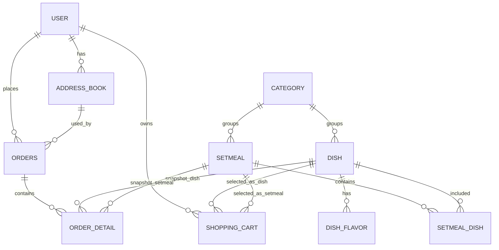
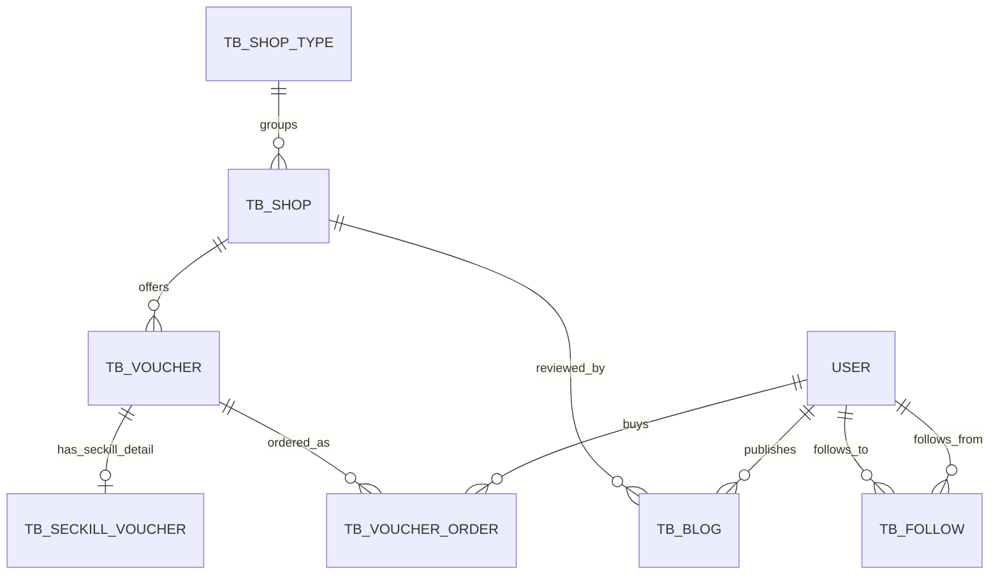

# 本地生活项目拆解笔记

这份笔记用于用更容易理解的方式拆解当前项目，适合在学习、复盘、面试准备时阅读。重点不是逐行背代码，而是先明白这个项目在做什么、每个模块负责什么、请求进来以后怎么流动。

## 1. 项目一句话说明

这个项目可以理解成一个“本地生活平台”后端：

```text
本地生活平台
= 外卖点餐系统
+ 门店和优惠券系统
+ 探店博客、点赞、关注、签到
+ 秒杀抢券
+ 商家后台管理
```

它不是单纯的外卖项目，也不是单纯的点评项目，而是把 `sky-take-out` 的外卖和后台管理骨架，与 `hm-dianping` 的 Redis 特色功能合并到一起。

## 2. 两个顶层文件夹的关系

当前工作区下主要有两个项目：

```text
L:\projects\java-hm-test
├── hm-dianping
└── sky-take-out
```

`hm-dianping` 是黑马点评原项目，重点是 Redis 场景，比如店铺缓存、优惠券秒杀、点赞、关注、签到。

`sky-take-out` 是当前主线项目，原本是苍穹外卖，已有员工后台、菜品、套餐、购物车、订单、报表、WebSocket 催单提醒等能力。现在它吸收了 `hm-dianping` 的本地生活功能，变成了一个更完整的本地生活后端。

学习和面试时，建议主要围绕 `sky-take-out` 来讲。

## 3. 常见英文词先解释

`Backend`：后端。负责处理登录、下单、查数据库、秒杀等真正业务逻辑。

`Frontend`：前端。用户能看到和点击的页面、小程序、App。

`Local Life Platform`：本地生活平台，例如美团、大众点评这类附近门店、外卖、团购、点评类平台。

`Take-out`：外卖。

`Store` / `Shop`：店铺。

`Voucher`：优惠券。

`Seckill`：秒杀，高并发抢购。

`Social`：社交，比如博客、点赞、关注、动态流。

`API`：接口。前端通过接口和后端通信。

`Controller`：控制器，负责接收 HTTP 请求。

`Service`：业务层，负责处理真正的业务规则。

`Mapper`：数据库访问层，负责执行 SQL，查询或修改 MySQL。

`DTO`：Data Transfer Object，前端传给后端的数据对象。

`VO`：View Object，后端返回给前端展示的数据对象。

`JWT`：JSON Web Token，一种登录凭证格式。

`Token`：登录后的电子通行证，前端之后每次请求都带着它。

`Redis`：内存数据库，速度快，适合验证码、缓存、点赞、签到、秒杀库存等场景。

`MySQL`：关系型数据库，适合长期保存用户、订单、店铺、优惠券等数据。

`Cache`：缓存，把常用数据放到 Redis，减少 MySQL 查询压力。

`Interceptor`：拦截器，请求进入 Controller 之前先检查 token 是否有效。

`High Concurrency`：高并发，很多用户同时请求。

`Asynchronous`：异步，先接收请求，再由后台慢慢处理。

`Message Queue`：消息队列，把任务排队处理。

`Mock`：模拟实现，方便本地演示，不依赖真实第三方服务。

## 4. sky-take-out 的三模块结构

`sky-take-out` 是一个 Maven 多模块项目：

```text
sky-take-out
├── sky-common
├── sky-pojo
└── sky-server
```

`sky-common` 是公共工具箱。里面放 JWT 工具、异常类、常量、工具类、OSS 上传、微信支付相关能力等。

`sky-pojo` 是数据模型层。里面放 `entity`、`dto`、`vo`。比如用户、店铺、订单、优惠券、博客这些 Java 对象。

`sky-server` 是真正干活的服务端。接口、业务逻辑、数据库访问、Redis、配置、SQL、Lua 脚本都在这里。学习代码时主要看这个模块。

## 5. 一次请求的流动过程

用户在前端点按钮后，后端一般这样处理：

```text
前端请求
-> Controller 接收请求
-> Service 处理业务逻辑
-> Mapper 访问 MySQL
-> 必要时读写 Redis
-> 返回统一结果给前端
```

举例：用户登录时，请求先进入 `UserController`，然后调用 `UserServiceImpl` 处理验证码校验、用户查询或注册、JWT 生成，最后返回登录结果。

相关文件：

- `sky-server/src/main/java/com/sky/controller/user/UserController.java`
- `sky-server/src/main/java/com/sky/service/impl/UserServiceImpl.java`
- `sky-server/src/main/java/com/sky/interceptor/JwtTokenUserInterceptor.java`
- `sky-server/src/main/java/com/sky/config/WebMvcConfiguration.java`

## 6. 登录和鉴权模块

登录模块解决的是“系统怎么知道当前用户是谁”。

它主要做三件事：

```text
1. 用户输入手机号，请求验证码
2. 用户提交手机号和验证码，后端校验
3. 登录成功后生成 JWT token，之后靠 token 识别用户
```

主要接口：

```text
POST /user/user/code        发送验证码
POST /user/user/login       登录
GET  /user/user/me          查询当前用户
POST /user/user/sign        每日签到
GET  /user/user/sign/count  连续签到天数
```

登录流程：

```text
输入手机号
-> 后端生成 6 位验证码
-> 验证码存入 Redis
-> 用户提交手机号 + 验证码
-> 后端校验验证码
-> 数据库里没有用户就自动注册
-> 数据库里已有用户就直接登录
-> 生成 JWT token 返回给前端
```

这个项目为了方便本地演示，没有真的接短信平台，而是把验证码打印到应用日志里。

## 7. 为什么要有拦截器

不是所有接口都能随便访问。比如下单、抢券、点赞、关注、签到，都必须知道当前用户是谁。

所以项目里有 `JwtTokenUserInterceptor`。它会在请求进入 Controller 前先检查：

```text
请求里有没有 token
-> token 是否正确
-> token 里能不能解析出用户 id
-> 通过后才放行
```

如果 token 错误或没有 token，就拒绝访问。

不过为了方便浏览和演示，部分接口不需要登录，比如：

```text
/user/user/code
/user/user/login
/user/store/**
/user/store-type/list
/user/voucher/list/**
/user/blog/hot
```

这样没登录也可以看门店、看优惠券、看热门博客；但要抢券、下单、点赞、关注、签到，就必须登录。

## 8. 用户端和管理端的区别

用户端接口一般以 `/user/**` 开头，面向普通用户：

```text
浏览店铺
查看优惠券
抢秒杀券
发博客
点赞关注
加入购物车
提交订单
支付订单
```

管理端接口一般以 `/admin/**` 开头，面向商家或管理员：

```text
员工管理
分类管理
菜品管理
套餐管理
订单管理
营业状态
数据报表
普通券和秒杀券创建
```

这种用户端和管理端分开的结构，是比较典型的后端项目设计。

## 9. 门店和优惠券模块概览

门店模块相当于大众点评或美团里的“找店”。

常见接口：

```text
GET /user/store-type/list  查询店铺分类
GET /user/store/{id}       查询店铺详情
GET /user/store/of/type    按分类查询店铺
GET /user/store/of/name    按名称搜索店铺
```

优惠券模块负责“看券”和“抢券”。

常见接口：

```text
GET  /user/voucher/list/{shopId}       查询某个店铺的优惠券
POST /user/voucher-order/seckill/{id}  秒杀抢券
```

店铺详情适合使用 Redis 缓存，因为店铺信息经常被查询，但不需要每次都去 MySQL 查。

## 10. 秒杀模块概览

秒杀是这个项目里最适合作为技术亮点讲的一块。

普通下单可以慢一点，但秒杀请求可能在一瞬间大量涌入。如果所有请求都直接打 MySQL，容易出现库存超卖、数据库压力过大等问题。

这个项目使用：

```text
Redis Lua
+ Redis Stream
+ 后台异步消费者
```

秒杀流程：

```text
用户点击抢券
-> 后端调用 Lua 脚本
-> Lua 在 Redis 中判断库存是否充足
-> Lua 判断用户是否已经抢过
-> 成功则扣减 Redis 库存
-> 把订单消息写入 stream.orders
-> 后台线程读取 Redis Stream
-> 最后创建 MySQL 优惠券订单
```

这里的核心思想是：用 Redis 先挡住高并发流量，保证资格判断和扣库存足够快；再用异步队列慢慢落库。

相关文件：

- `sky-server/src/main/java/com/sky/controller/user/VoucherOrderController.java`
- `sky-server/src/main/java/com/sky/service/impl/VoucherOrderServiceImpl.java`
- `sky-server/src/main/resources/seckill.lua`

## 11. 社交模块概览

社交模块来自黑马点评的思路，包括博客、点赞、关注、共同关注、关注动态流、签到。

常见接口：

```text
POST /user/blog              发布博客
PUT  /user/blog/like/{id}    点赞或取消点赞
GET  /user/blog/hot          查询热门博客
GET  /user/blog/of/follow    查询关注人的动态
PUT  /user/follow/{id}/{isFollow} 关注或取消关注
GET  /user/follow/common/{id}     查询共同关注
POST /user/user/sign         签到
GET  /user/user/sign/count   查询连续签到天数
```

Redis 数据结构对应关系：

```text
点赞列表 -> ZSet
关注关系 -> Set
共同关注 -> Set 交集
签到记录 -> BitMap
关注动态 -> ZSet 时间排序
```

## 12. 外卖订单模块概览

外卖主流程来自苍穹外卖：

```text
查询分类
-> 查询菜品或套餐
-> 加入购物车
-> 提交订单
-> 支付订单
-> 商家接单
-> 派送
-> 完成
```

常见接口：

```text
/user/category/list
/user/dish/list
/user/setmeal/list
/user/shoppingCart/add
/user/order/submit
/user/order/payment
/user/order/historyOrders
```

项目里还做了 `mock payment`，也就是模拟支付。这样本地演示时不依赖真实微信支付环境。

## 13. 面试时可以这样概括

可以用下面这段话介绍项目：

> 这个项目是一个基于 Spring Boot 的本地生活后端系统。我以苍穹外卖作为主体框架，保留了外卖下单、商家后台、订单管理和报表能力，同时融合了黑马点评里的 Redis 场景，比如店铺缓存、优惠券秒杀、博客点赞、关注和签到。技术亮点主要是 JWT 登录、Redis 多数据结构应用，以及 Lua + Redis Stream 实现的异步秒杀下单。

如果要讲得更细，可以按这个顺序展开：

```text
1. 登录和 JWT 鉴权
2. 门店与优惠券浏览
3. Lua + Redis Stream 秒杀抢券
4. 博客、点赞、关注、签到
5. 外卖购物车、下单、支付
6. 管理端订单、菜品、报表
```

## 14. 推荐阅读顺序

先看项目说明：

- `README.md`
- `API_OVERVIEW.md`

再看登录：

- `sky-server/src/main/java/com/sky/controller/user/UserController.java`
- `sky-server/src/main/java/com/sky/service/impl/UserServiceImpl.java`
- `sky-server/src/main/java/com/sky/interceptor/JwtTokenUserInterceptor.java`

再看门店和优惠券：

- `sky-server/src/main/java/com/sky/controller/user/StoreController.java`
- `sky-server/src/main/java/com/sky/service/impl/StoreServiceImpl.java`
- `sky-server/src/main/java/com/sky/controller/user/VoucherController.java`
- `sky-server/src/main/java/com/sky/service/impl/VoucherServiceImpl.java`

最后看秒杀：

- `sky-server/src/main/java/com/sky/controller/user/VoucherOrderController.java`
- `sky-server/src/main/java/com/sky/service/impl/VoucherOrderServiceImpl.java`
- `sky-server/src/main/resources/seckill.lua`

## 15. 门店和优惠券模块细拆

这一块可以理解成“用户逛店铺、看优惠券、管理员创建券”的业务。

它处在登录模块和秒杀模块中间：

```text
用户先浏览门店
-> 查看某个门店有哪些优惠券
-> 如果是普通券，只展示和购买
-> 如果是秒杀券，进入秒杀抢券流程
```

### 15.1 门店分类

门店分类接口：

```text
GET /user/store-type/list
```

对应代码：

```text
StoreTypeController
-> StoreTypeServiceImpl
-> ShopTypeMapper
-> tb_shop_type
```

它的逻辑很简单：从 `tb_shop_type` 表中查出所有分类，并按照 `sort` 和 `id` 排序。

可以把它理解成页面顶部的分类入口，例如：

```text
美食
咖啡
甜品
小吃
```

相关文件：

- `sky-server/src/main/java/com/sky/controller/user/StoreTypeController.java`
- `sky-server/src/main/java/com/sky/service/impl/StoreTypeServiceImpl.java`
- `sky-server/src/main/java/com/sky/mapper/ShopTypeMapper.java`

### 15.2 门店查询

门店接口主要有三个：

```text
GET /user/store/{id}       查询店铺详情
GET /user/store/of/type    按分类查询店铺
GET /user/store/of/name    按名称搜索店铺
```

对应代码：

```text
StoreController
-> StoreServiceImpl
-> ShopMapper
-> tb_shop
```

`/user/store/{id}` 是查一个店铺详情。这个接口使用了 Redis 缓存。

流程是：

```text
先根据 store id 拼出 Redis key
-> 去 Redis 查缓存
-> 如果 Redis 有店铺 JSON，就直接返回
-> 如果 Redis 有空字符串，说明之前查过但店铺不存在，直接返回空
-> 如果 Redis 没有，再查 MySQL
-> MySQL 查到了，就把店铺 JSON 写入 Redis
-> MySQL 查不到，就把空字符串写入 Redis，短时间缓存
```

这里有两个重要概念：

`缓存穿透`：用户一直查不存在的数据，如果每次都打到 MySQL，数据库会被浪费查询压垮。

`空值缓存`：如果某个 id 的店铺不存在，也在 Redis 里短时间存一个空值，后面再查这个 id 就不用打 MySQL。

按分类查询：

```text
GET /user/store/of/type?typeId=1&current=1
```

它会按照销量 `sold` 倒序、id 倒序查询。`current` 表示当前页。

按名称搜索：

```text
GET /user/store/of/name?name=coffee&current=1
```

它会用 `like` 模糊查询店铺名，也会做分页。

相关文件：

- `sky-server/src/main/java/com/sky/controller/user/StoreController.java`
- `sky-server/src/main/java/com/sky/service/impl/StoreServiceImpl.java`
- `sky-server/src/main/java/com/sky/mapper/ShopMapper.java`

### 15.3 门店表

门店相关表主要有两张：

```text
tb_shop_type  店铺分类表
tb_shop       店铺表
```

`tb_shop_type` 里主要存：

```text
id
name  分类名称
icon  分类图标
sort  排序值
```

`tb_shop` 里主要存：

```text
id
name        店铺名称
type_id     所属分类
images      店铺图片
area        区域
address     地址
x / y       坐标
avg_price   人均价格
sold        销量
comments    评论数
score       评分
open_hours  营业时间
```

### 15.4 优惠券查询

用户查看某个店铺的优惠券：

```text
GET /user/voucher/list/{shopId}
```

对应代码：

```text
VoucherController
-> VoucherServiceImpl
-> VoucherMapper
-> tb_voucher
-> tb_seckill_voucher
```

这里查询时会把普通优惠券和秒杀优惠券一起查出来。

SQL 里用了 `left join`：

```text
tb_voucher
left join tb_seckill_voucher
```

意思是：所有优惠券都查出来，如果它同时是秒杀券，就把秒杀库存、开始时间、结束时间也带出来。

### 15.5 普通券和秒杀券的区别

普通券只需要存在 `tb_voucher` 表里。

秒杀券需要两部分数据：

```text
tb_voucher           优惠券基础信息
tb_seckill_voucher   秒杀库存、开始时间、结束时间
```

普通券更像：

```text
满 100 减 50
长期可用
```

秒杀券更像：

```text
限时抢购
库存 50 张
每人限抢 1 张
```

### 15.6 管理员创建优惠券

管理员创建普通券：

```text
POST /admin/voucher
```

管理员创建秒杀券：

```text
POST /admin/voucher/seckill
```

对应代码：

```text
admin.VoucherController
-> VoucherServiceImpl
-> VoucherMapper
-> SeckillVoucherMapper
```

创建普通券时，只插入 `tb_voucher`。

创建秒杀券时，会做三件事：

```text
1. 先插入 tb_voucher，生成 voucher id
2. 再插入 tb_seckill_voucher，保存库存和秒杀时间
3. 把秒杀库存写入 Redis
```

第三步很关键，叫“库存预热”。

`库存预热` 的意思是：秒杀开始前，先把库存放到 Redis。用户真正抢券时，就先在 Redis 里扣库存，而不是直接查 MySQL。

### 15.7 这块和秒杀模块的关系

门店和优惠券模块负责“展示”和“创建券”。

秒杀模块负责“抢券”和“下单”。

关系可以这样理解：

```text
管理员创建秒杀券
-> 秒杀库存写入 Redis
-> 用户浏览店铺优惠券
-> 用户点击抢券
-> 秒杀模块用 Lua 扣 Redis 库存
-> 后台异步创建优惠券订单
```

所以这一块不是孤立的，它是在给秒杀模块准备数据。

### 15.8 面试可以怎么讲

可以这样说：

> 门店和优惠券模块负责本地生活平台中的浏览和营销能力。用户可以按分类、名称浏览店铺，也可以查看店铺下的普通券和秒杀券。店铺详情使用 Redis 缓存，并通过空值缓存缓解缓存穿透。管理员创建秒杀券时，系统会同时写入优惠券表、秒杀券表，并把库存预热到 Redis，为后续 Lua 秒杀扣库存做准备。

如果面试官追问“为什么要把库存放 Redis”，可以回答：

> 因为秒杀请求并发高，如果每个请求都直接查 MySQL 和扣 MySQL 库存，数据库压力会很大，也更容易出现超卖。把库存预热到 Redis 后，抢券资格判断和扣库存都可以先在 Redis 中完成，速度更快，也更适合高并发场景。

## 16. 秒杀模块细拆

秒杀模块是这个项目里最适合重点讲的技术亮点。

它解决的问题不是“普通下单”，而是“很多用户同时抢同一张券”。

如果设计得不好，会出现这些问题：

```text
库存只有 50 张，但卖出去 60 张 -> 超卖
同一个用户重复抢多张 -> 一人一单失效
所有请求都打 MySQL -> 数据库压力过大
用户一直等数据库写入 -> 接口响应慢
```

所以这个项目用的是：

```text
Redis Lua 原子判断资格
+ Redis Stream 消息队列
+ 后台线程异步创建订单
+ MySQL 唯一索引和库存扣减兜底
```

### 16.1 秒杀入口

用户抢券接口：

```text
POST /user/voucher-order/seckill/{id}
```

其中 `{id}` 是优惠券 id，也就是 `voucherId`。

代码入口：

```text
VoucherOrderController
-> VoucherOrderServiceImpl.seckillVoucher(voucherId)
```

相关文件：

- `sky-server/src/main/java/com/sky/controller/user/VoucherOrderController.java`
- `sky-server/src/main/java/com/sky/service/impl/VoucherOrderServiceImpl.java`

### 16.2 进入 Service 后先做什么

`seckillVoucher` 方法会先做几步普通校验：

```text
1. 从 BaseContext 里拿当前登录用户 id
2. 如果用户没登录，直接报错
3. 查询 tb_seckill_voucher，看这张券是不是秒杀券
4. 判断当前时间是否早于开始时间
5. 判断当前时间是否晚于结束时间
6. 如果 Redis 里还没有库存 key，就用数据库库存初始化一次
```

这里的 `BaseContext` 可以理解成“当前请求用户信息的临时存放处”。

用户登录后，JWT 拦截器会解析 token，把用户 id 放进去。后面的业务代码就可以从 `BaseContext` 里知道当前用户是谁。

### 16.3 订单 id 怎么生成

秒杀请求通过校验后，会先生成一个订单 id：

```text
long orderId = redisIdWorker.nextId("voucher-order");
```

相关文件：

- `sky-server/src/main/java/com/sky/utils/RedisIdWorker.java`

`RedisIdWorker` 的思路是：

```text
时间戳部分
+ Redis 自增序号部分
= 一个比较长且基本不会重复的订单 id
```

它不是直接用数据库自增 id，因为秒杀场景里订单可能先进入 Redis Stream，后面才异步写入 MySQL。提前生成订单 id 更方便。

### 16.4 为什么用 Lua 脚本

秒杀最怕这两件事：

```text
库存判断和扣库存不是同一步
判断用户是否重复下单和记录用户不是同一步
```

如果分多次 Redis 命令执行，中间可能被别的请求插进来。

Lua 脚本的作用是：把多步 Redis 操作打包成一个整体执行。

在 Redis 里执行 Lua 时，这段脚本是原子的。

`原子` 的意思是：要么这一整段执行完，要么别的请求不能插到中间。

Lua 脚本文件：

- `sky-server/src/main/resources/seckill.lua`

### 16.5 Lua 脚本在做什么

脚本接收三个参数：

```text
ARGV[1] voucherId  优惠券 id
ARGV[2] userId     用户 id
ARGV[3] orderId    订单 id
```

它拼出两个 Redis key：

```text
seckill:stock:{voucherId}  秒杀券库存
seckill:order:{voucherId}  已抢过这张券的用户集合
```

执行流程：

```text
1. 读取库存
2. 如果库存 <= 0，返回 1
3. 判断当前用户是否已经在抢券用户集合里
4. 如果已经抢过，返回 2
5. Redis 库存减 1
6. 把用户 id 加入已抢用户集合
7. 往 stream.orders 写入一条订单消息
8. 返回 0，表示成功
```

返回码含义：

```text
0 成功
1 库存不足
2 用户重复下单
```

这里的 `Set` 是 Redis 集合。用它记录哪些用户已经抢过这张券，可以快速判断“一人一单”。

### 16.6 Redis Stream 是什么

`Redis Stream` 可以先理解成 Redis 里的消息队列。

消息队列的作用是：把任务先排队，后台慢慢处理。

这个项目里，Lua 脚本抢券成功后，不是直接写 MySQL，而是写入：

```text
stream.orders
```

消息内容大概是：

```text
userId    谁抢的
voucherId 抢哪张券
id        订单 id
```

这样接口可以快速返回，真正创建数据库订单交给后台线程处理。

### 16.7 后台消费者怎么工作

`VoucherOrderServiceImpl` 启动时会执行 `init()`：

```text
1. 初始化 Stream 消费组
2. 启动一个单线程后台任务
```

相关概念：

`Consumer Group`：消费者组。多个消费者可以一起消费队列消息。

`Consumer`：消费者。真正读取和处理消息的角色。

`ACK`：确认消息处理完成。处理成功后告诉 Redis 这条消息可以标记完成。

`Pending List`：待确认列表。消息被读走但还没 ACK，如果处理失败，就会留在这里，后面可以重试。

项目里使用：

```text
消费组: g1
消费者: c1
队列名: stream.orders
```

后台线程循环做这些事：

```text
1. 从 stream.orders 读取一条消息
2. 如果没有消息，就阻塞等待一会儿
3. 有消息就转成 VoucherOrder 对象
4. 调用 handleVoucherOrder 创建数据库订单
5. 成功后 ACK 消息
6. 如果异常，就处理 Pending List 里的消息
```

### 16.8 真正落库时还有哪些兜底

虽然 Redis Lua 已经做了库存和重复下单判断，但落 MySQL 时仍然做了兜底。

第一层兜底：再查一次用户是否已经买过这张券。

```text
countByUserAndVoucher(userId, voucherId)
```

第二层兜底：扣 MySQL 库存时带条件。

```text
update tb_seckill_voucher
set stock = stock - 1
where voucher_id = ?
and stock > 0
```

如果库存已经没了，更新行数就是 0，不会继续创建订单。

第三层兜底：数据库唯一索引。

`tb_voucher_order` 表里有：

```text
UNIQUE KEY uk_voucher_user (user_id, voucher_id)
```

这表示同一个用户和同一张券，只能出现一条订单记录。

所以这套设计不是只靠 Redis，而是：

```text
Redis 负责高并发快速拦截
MySQL 负责最终数据一致性兜底
```

### 16.9 为什么不直接写 MySQL

如果用户点击抢券后直接写 MySQL，流程可能是：

```text
查库存
-> 判断是否重复
-> 扣库存
-> 插订单
```

高并发时，这些请求会同时压到 MySQL 上。

这个项目改成：

```text
用户请求
-> Redis Lua 快速判断
-> 成功后写入 Redis Stream
-> 立即返回订单 id
-> 后台异步写 MySQL
```

好处是：

```text
接口响应更快
MySQL 压力更小
库存判断更集中
一人一单更容易控制
失败消息可以通过 Pending List 重试
```

### 16.10 这块的完整链路

可以把秒杀链路记成这一张图：

```text
用户带 token 请求抢券
-> JWT 拦截器确认用户身份
-> VoucherOrderController 接收请求
-> VoucherOrderServiceImpl 校验活动时间
-> RedisIdWorker 生成订单 id
-> 执行 seckill.lua
-> Redis 判断库存和重复下单
-> Redis 扣库存并写 stream.orders
-> 接口返回订单 id
-> 后台线程读取 stream.orders
-> TransactionTemplate 开启事务
-> MySQL 扣库存
-> MySQL 插入 tb_voucher_order
-> ACK Stream 消息
```

### 16.11 面试可以怎么讲

可以这样讲：

> 秒杀模块我用 Redis Lua + Redis Stream 做了异步下单。用户抢券时，接口先校验登录状态和活动时间，然后通过 RedisIdWorker 生成订单 id。核心资格判断放在 Lua 脚本里完成，包括库存是否充足、一人一单校验、Redis 扣库存和写入 Stream。Lua 成功后接口直接返回订单 id，后台消费者再从 Redis Stream 读取消息，在事务里扣 MySQL 库存并创建优惠券订单。

如果面试官问“怎么防止超卖”，可以说：

> 第一层是 Lua 在 Redis 中原子扣库存，请求并发再高也不会把 Redis 库存扣成负数。第二层是 MySQL 扣库存时带 `stock > 0` 条件。第三层是数据库里对 `user_id + voucher_id` 做唯一索引，防止同一用户重复生成订单。

如果面试官问“为什么用 Stream”，可以说：

> Stream 相当于 Redis 的消息队列。秒杀请求只做资格判断和入队，真正写 MySQL 的动作由后台消费者异步处理。这样可以减少接口耗时，也能削峰，避免所有请求同时打到数据库。

### 16.12 这一块容易混的英文词

`Lua`：一种脚本语言，这里用于在 Redis 内部一次性执行多条命令。

`Atomic`：原子性，表示一组操作不会被其他请求插队打断。

`Stream`：Redis 的消息流，可以当消息队列使用。

`Consumer`：消费者，负责从队列里取消息并处理。

`Consumer Group`：消费者组，用来组织多个消费者一起处理消息。

`ACK`：确认消息处理成功。

`Pending List`：已经被消费但还没有确认成功的消息列表。

`Transaction`：事务，要么一起成功，要么一起失败。

`Unique Index`：唯一索引，用数据库约束保证某些字段组合不能重复。

`Oversell`：超卖，库存不够却卖出了更多订单。

`Fallback`：兜底方案，前面防线失效时，后面还有保护。

## 17. 社交模块细拆

社交模块可以理解成“本地生活平台里的点评社区”。

它不是外卖下单主流程，但很适合展示 Redis 数据结构的使用：

```text
博客发布 -> MySQL 保存博客
博客点赞 -> Redis ZSet 记录点赞用户和时间
关注用户 -> MySQL + Redis Set 保存关注关系
共同关注 -> Redis Set 求交集
关注动态 -> Redis ZSet 做收件箱
每日签到 -> Redis BitMap 记录每天是否签到
```

这一块主要来自黑马点评项目的思路，合并到了 `sky-take-out` 的用户端接口里。

### 17.1 社交模块有哪些接口

博客接口：

```text
POST /user/blog              发布博客
PUT  /user/blog/like/{id}    点赞或取消点赞
GET  /user/blog/of/me        查询我的博客
GET  /user/blog/hot          查询热门博客
GET  /user/blog/{id}         查询博客详情
GET  /user/blog/likes/{id}   查询博客前几个点赞用户
GET  /user/blog/of/user      查询某个用户的博客
GET  /user/blog/of/follow    查询关注人的动态
```

关注接口：

```text
PUT /user/follow/{id}/{isFollow}  关注或取消关注
GET /user/follow/or/not/{id}      判断是否已关注
GET /user/follow/common/{id}      查询共同关注
```

签到接口在用户模块里：

```text
POST /user/user/sign        签到
GET  /user/user/sign/count  查询连续签到天数
```

相关文件：

- `sky-server/src/main/java/com/sky/controller/user/BlogController.java`
- `sky-server/src/main/java/com/sky/service/impl/BlogServiceImpl.java`
- `sky-server/src/main/java/com/sky/controller/user/FollowController.java`
- `sky-server/src/main/java/com/sky/service/impl/FollowServiceImpl.java`
- `sky-server/src/main/java/com/sky/service/impl/UserServiceImpl.java`

### 17.2 博客发布

发布博客的入口：

```text
POST /user/blog
```

代码链路：

```text
BlogController.saveBlog
-> BlogServiceImpl.saveBlog
-> BlogMapper.insert
-> tb_blog
```

发布时会做这些事：

```text
1. 从 BaseContext 里拿当前登录用户 id
2. 给博客填充 userId、liked、comments、createTime、updateTime
3. 插入 tb_blog 表
4. 查询当前用户的粉丝
5. 把新博客 id 推送到每个粉丝的 feed ZSet 里
```

这里的 `feed` 可以理解成“关注动态收件箱”。

比如用户 A 发了一篇博客，用户 B、C 关注了 A，那么系统会把这篇博客 id 写入：

```text
feed:B
feed:C
```

这样 B、C 查询关注动态时，不需要现场去全库扫描“我关注的人都发了什么”，而是直接读自己的 feed。

### 17.3 关注动态为什么用 ZSet

关注动态用的是 Redis `ZSet`。

`ZSet` 是有序集合，可以同时存：

```text
value  博客 id
score  发布时间戳
```

也就是说：

```text
feed:{userId}
里面存的是这个用户应该看到的博客 id
score 是博客发布时间
```

查询关注动态时：

```text
GET /user/blog/of/follow?lastId=时间戳&offset=0
```

服务端会从 `feed:{当前用户id}` 里按时间倒序取博客 id，然后再去 MySQL 查博客详情。

这里使用的是滚动分页，而不是普通页码分页。

`滚动分页` 的意思是：下一页不是传 `page=2`，而是传上一页最后一条的时间戳和偏移量。

这样适合时间流场景，比如关注动态、朋友圈、微博信息流。

### 17.4 点赞和取消点赞

点赞接口：

```text
PUT /user/blog/like/{id}
```

对应代码：

```text
BlogServiceImpl.likeBlog
```

点赞使用 Redis `ZSet`：

```text
blog:liked:{blogId}
```

其中：

```text
value = userId
score = 点赞时间戳
```

点赞流程：

```text
1. 查当前用户是否已经在 blog:liked:{blogId} 里
2. 如果不在，说明还没点赞
3. MySQL 中博客 liked + 1
4. Redis ZSet 加入当前用户
5. 如果已经在，说明要取消点赞
6. MySQL 中博客 liked - 1
7. Redis ZSet 移除当前用户
```

为什么点赞也用 ZSet？

因为不仅要知道“用户有没有点过赞”，还要能按点赞时间取前几个点赞用户。

查询点赞用户：

```text
GET /user/blog/likes/{id}
```

系统会从 `blog:liked:{blogId}` 取前 5 个用户 id，再查用户信息返回。

### 17.5 热门博客

热门博客接口：

```text
GET /user/blog/hot?current=1
```

它主要查 MySQL：

```text
select * from tb_blog order by liked desc, create_time desc
```

也就是按点赞数倒序，再按发布时间倒序。

查出来以后会做一个补充操作，代码里叫 `enrichBlog`。

`enrich` 的意思是“补充信息”。这里会给博客补上：

```text
作者昵称
作者头像
当前登录用户是否点过赞
```

### 17.6 关注和取消关注

关注接口：

```text
PUT /user/follow/{id}/{isFollow}
```

其中：

```text
id        要关注的用户 id
isFollow true 表示关注，false 表示取消关注
```

关注时：

```text
1. MySQL 插入 tb_follow
2. Redis Set 加入 followUserId
```

取消关注时：

```text
1. MySQL 删除 tb_follow 里的关系
2. Redis Set 移除 followUserId
```

Redis key：

```text
follows:{userId}
```

里面存的是当前用户关注了哪些人。

这里用 `Set`，因为关注关系天然适合集合：

```text
判断是否包含某个人
添加关注
取消关注
求共同关注
```

### 17.7 共同关注

共同关注接口：

```text
GET /user/follow/common/{id}
```

它要回答的问题是：

```text
我关注的人
和另一个用户关注的人
有哪些是一样的？
```

用 Redis Set 很方便：

```text
follows:{当前用户id}
和
follows:{对方用户id}
求交集
```

`交集` 的意思是两个集合里共同存在的元素。

比如：

```text
我关注了: A, B, C
对方关注了: B, C, D
共同关注就是: B, C
```

代码里如果 Redis 里还没有某个用户的关注集合，会先从 MySQL 加载一遍，再写入 Redis。

### 17.8 签到模块

签到接口：

```text
POST /user/user/sign
```

连续签到天数接口：

```text
GET /user/user/sign/count
```

签到使用 Redis `BitMap`。

`BitMap` 可以理解成一串 0 和 1：

```text
0 表示没签到
1 表示已签到
```

每个用户每个月一个 key：

```text
sign:{userId}:yyyyMM
```

比如某个用户 2026 年 5 月的签到 key 可能是：

```text
sign:1:202605
```

第 1 天签到，就把第 0 位设置为 1。

第 2 天签到，就把第 1 位设置为 1。

代码里是：

```text
setBit(key, dayOfMonth - 1, true)
```

### 17.9 连续签到怎么算

连续签到统计用的是 `bitField`。

它会取出本月从 1 号到今天的签到记录，得到一个二进制数字。

然后代码从最低位开始数连续的 1：

```text
while ((num & 1) == 1) {
    count++;
    num >>>= 1;
}
```

可以简单理解成：

```text
今天签到了吗？
昨天签到了吗？
前天签到了吗？
一直往前数，直到遇到某一天没签到
```

这种方式比每天建一条数据库记录更轻量。

### 17.10 社交模块的数据表

社交模块主要有两张表：

```text
tb_blog    博客表
tb_follow  关注关系表
```

`tb_blog` 主要字段：

```text
id
shop_id      关联店铺
user_id      发布用户
title        标题
images       图片
content      内容
liked        点赞数
comments     评论数
create_time
update_time
```

`tb_follow` 主要字段：

```text
id
user_id          当前用户
follow_user_id   被关注用户
create_time
```

`tb_follow` 里还有唯一索引：

```text
UNIQUE KEY uk_follow_relation (user_id, follow_user_id)
```

这可以防止同一个用户重复关注同一个人。

### 17.11 Redis 数据结构总结

这一块可以记成表格：

```text
场景          Redis 结构  key 示例
点赞          ZSet        blog:liked:{blogId}
关注动态      ZSet        feed:{userId}
关注关系      Set         follows:{userId}
共同关注      Set 交集    follows:A 和 follows:B
签到          BitMap      sign:{userId}:yyyyMM
```

为什么这些结构合适？

```text
点赞需要按时间排序 -> ZSet
动态流需要按时间排序 -> ZSet
关注关系需要判断包含和求交集 -> Set
签到只需要每天 0/1 -> BitMap
```

### 17.12 面试可以怎么讲

可以这样讲：

> 社交模块主要包括博客、点赞、关注、共同关注、关注动态和签到。我用 MySQL 保存博客和关注关系的最终数据，用 Redis 提升社交互动场景的查询效率。点赞列表用 ZSet 存用户 id 和点赞时间，方便判断是否点赞和查询前几个点赞用户；关注关系用 Set，方便关注、取消关注和共同关注求交集；关注动态用 ZSet 做用户收件箱，发布博客时把博客 id 推给粉丝；签到用 BitMap，用每个月的一串 bit 记录每天是否签到，并通过 bitField 计算连续签到天数。

如果面试官问“为什么不用 MySQL 直接做这些”，可以说：

> MySQL 适合保存最终数据，但点赞、关注、签到这些操作频繁、读写细碎，而且很多逻辑天然符合 Redis 数据结构。比如共同关注就是集合交集，签到就是 0/1 位图，关注流需要按时间排序。所以 MySQL 负责持久化，Redis 负责高频互动和快速查询。

### 17.13 这一块容易混的英文词

`Blog`：博客、探店笔记。

`Like`：点赞。

`Follow`：关注。

`Feed`：动态流，关注的人发的新内容。

`Timeline`：时间线，按时间排序的信息流。

`ZSet`：有序集合，每个元素都有一个分数，可以按分数排序。

`Set`：集合，元素不重复，适合判断包含和求交集。

`BitMap`：位图，用二进制位记录状态，适合签到这种每天是或否的场景。

`Intersection`：交集，两个集合共同拥有的元素。

`Enrich`：补充信息，比如给博客补上作者昵称、头像、是否点赞。

`Scroll Pagination`：滚动分页，用最后一条记录的位置继续往下翻，适合动态流。

## 18. 外卖订单模块细拆

外卖订单模块是 `sky-take-out` 原本最核心的业务。

前面讲的门店、优惠券、社交偏“本地生活扩展”，这一块偏“真正交易闭环”：

```text
用户选菜
-> 加入购物车
-> 提交订单
-> 支付订单
-> 商家接单
-> 配送
-> 完成
```

这一块最重要的是理解三个东西：

```text
购物车怎么变成订单
订单状态怎么流转
用户端和管理端分别能做什么
```

### 18.1 订单模块有哪些接口

购物车接口：

```text
POST   /user/shoppingCart/add    添加购物车
POST   /user/shoppingCart/sub    减少购物车中一个商品
GET    /user/shoppingCart/list   查看购物车
DELETE /user/shoppingCart/clean  清空购物车
```

用户订单接口：

```text
POST /user/order/submit              提交订单
PUT  /user/order/payment             支付订单
GET  /user/order/historyOrders       查询历史订单
GET  /user/order/orderDetail/{id}    查询订单详情
PUT  /user/order/cancel/{id}         用户取消订单
POST /user/order/repetition/{id}     再来一单
GET  /user/order/reminder/{id}       催单
```

后台订单接口：

```text
GET /admin/order/conditionSearch     订单搜索
GET /admin/order/statistics          各状态订单数量
GET /admin/order/details/{id}        订单详情
PUT /admin/order/confirm             商家接单
PUT /admin/order/rejection           商家拒单
PUT /admin/order/cancel              管理端取消订单
PUT /admin/order/delivery/{id}       派送订单
PUT /admin/order/complete/{id}       完成订单
```

相关文件：

- `sky-server/src/main/java/com/sky/controller/user/ShoppingCartController.java`
- `sky-server/src/main/java/com/sky/service/impl/ShoppingCartServiceImpl.java`
- `sky-server/src/main/java/com/sky/controller/user/OrderController.java`
- `sky-server/src/main/java/com/sky/controller/admin/OrderController.java`
- `sky-server/src/main/java/com/sky/service/impl/OrderServiceImpl.java`

### 18.2 购物车模块

购物车是下单前的临时容器。

用户把菜品或套餐加入购物车，系统会保存到 `shopping_cart` 表。

添加购物车流程：

```text
1. 从 BaseContext 拿当前用户 id
2. 判断购物车里是否已经有同一个菜品或套餐
3. 如果已经有，数量 number + 1
4. 如果没有，查询菜品或套餐信息
5. 把名称、图片、价格、数量写入 shopping_cart
```

这里要注意：购物车里既可能放菜品，也可能放套餐。

所以代码会判断：

```text
dishId != null     表示添加的是菜品
setmealId != null  表示添加的是套餐
```

减少购物车商品时：

```text
如果数量是 1 -> 直接删除这一条购物车记录
如果数量大于 1 -> 数量减 1
```

### 18.3 提交订单流程

提交订单接口：

```text
POST /user/order/submit
```

代码链路：

```text
user.OrderController.submit
-> OrderServiceImpl.submitOrder
-> OrderMapper.insert
-> OrderDetailMapper.insertBatch
-> ShoppingCartMapper.deleteByUserId
```

提交订单时会做这些事：

```text
1. 根据 addressBookId 查询收货地址
2. 如果地址不存在，抛出异常
3. 查询当前用户购物车
4. 如果购物车为空，抛出异常
5. 创建 orders 主订单
6. 把购物车每一项复制成 order_detail 订单明细
7. 批量插入订单明细
8. 清空当前用户购物车
9. 返回订单 id、下单时间、订单号、金额
```

这里有两个表：

```text
orders        订单主表
order_detail  订单明细表
```

`orders` 记录一笔订单整体信息，比如：

```text
订单号
用户 id
收货地址
手机号
订单金额
订单状态
支付状态
下单时间
```

`order_detail` 记录订单里买了哪些东西，比如：

```text
菜品名
套餐名
数量
金额
口味
图片
```

一笔订单可以有多条订单明细。

### 18.4 订单状态

订单状态定义在 `Orders` 实体类里。

状态值：

```text
1 待付款
2 待接单
3 已接单
4 派送中
5 已完成
6 已取消
```

支付状态：

```text
0 未支付
1 已支付
2 退款
```

正常流程是：

```text
提交订单
-> 待付款
-> 支付成功
-> 待接单
-> 商家接单
-> 已接单
-> 商家点派送
-> 派送中
-> 商家点完成
-> 已完成
```

异常流程可能是：

```text
待付款 -> 用户取消 -> 已取消
待接单 -> 用户取消 -> 已取消 + 可能退款
待接单 -> 商家拒单 -> 已取消 + 可能退款
已接单/派送中 -> 管理端取消 -> 已取消 + 可能退款
```

### 18.5 支付模块和 mock pay

支付接口：

```text
PUT /user/order/payment
```

原始苍穹外卖项目是对接微信支付的，所以代码里有 `WeChatPayUtil`。

但当前合并项目为了本地演示，支持 `mock payment`。

`mock payment` 就是模拟支付。

为什么需要它？

因为手机号登录的本地演示用户通常没有微信 `openid`。如果强依赖真实微信支付，本地就很难完整演示“提交订单 -> 支付成功 -> 商家接单”这条链路。

所以当前逻辑是：

```text
如果用户有 openid -> 走真实微信支付
如果用户没有 openid 且 mock-enabled=true -> 走模拟支付
如果用户没有 openid 且 mock-enabled=false -> 报错
```

模拟支付会直接调用：

```text
paySuccess(orderNumber)
```

也就是把订单标记为支付成功。

### 18.6 支付成功后发生什么

支付成功后，订单会从：

```text
待付款
```

变成：

```text
待接单
```

也就是：

```text
status: 1 -> 2
payStatus: 0 -> 1
checkoutTime: 当前时间
```

代码里不是随便更新，而是调用：

```text
updateByIdAndStatus(orders, Orders.PENDING_PAYMENT)
```

意思是：只有当前订单还处于“待付款”状态时，才允许改成“待接单”。

这是一种状态保护，防止重复支付回调、并发更新或错误状态流转。

支付成功后，还会通过 WebSocket 通知后台：

```text
有新订单来了
```

`WebSocket` 可以理解成后端主动给前端推消息的通道。

### 18.7 用户侧订单功能

用户可以查询历史订单：

```text
GET /user/order/historyOrders
```

查询时会按当前用户 id 和订单状态分页查询。

用户可以查询订单详情：

```text
GET /user/order/orderDetail/{id}
```

订单详情会同时返回：

```text
订单主信息
订单明细列表
```

用户取消订单：

```text
PUT /user/order/cancel/{id}
```

规则：

```text
如果订单不存在 -> 报错
如果订单状态大于待接单 -> 不允许取消
如果订单已经支付 -> 需要退款或 mock 跳过真实退款
然后改成已取消
```

再来一单：

```text
POST /user/order/repetition/{id}
```

逻辑是：

```text
查询原订单的 order_detail
-> 把每一条明细复制成 shopping_cart
-> 插回当前用户购物车
```

也就是用户点“再来一单”后，系统不是直接创建新订单，而是先帮用户把商品重新加入购物车。

催单：

```text
GET /user/order/reminder/{id}
```

它会通过 WebSocket 给后台发送一条提醒消息。

### 18.8 管理端订单功能

后台可以搜索订单：

```text
GET /admin/order/conditionSearch
```

可以按订单号、手机号、状态、时间范围等条件分页查询。

后台可以看各状态订单数量：

```text
GET /admin/order/statistics
```

主要统计：

```text
待接单数量
已接单数量
派送中数量
```

商家接单：

```text
PUT /admin/order/confirm
```

状态变化：

```text
待接单 -> 已接单
```

商家拒单：

```text
PUT /admin/order/rejection
```

状态变化：

```text
待接单 -> 已取消
```

如果订单已支付，需要退款或 mock 跳过真实退款。

派送订单：

```text
PUT /admin/order/delivery/{id}
```

状态变化：

```text
已接单 -> 派送中
```

完成订单：

```text
PUT /admin/order/complete/{id}
```

状态变化：

```text
派送中 -> 已完成
```

这些状态变化都通过 `updateOrderWithExpectedStatus` 做保护：只有当前状态符合预期，才允许进入下一个状态。

### 18.9 为什么状态保护很重要

订单系统最怕状态乱跳。

比如：

```text
还没支付的订单被接单
已经取消的订单又被派送
已经完成的订单又被取消
重复支付回调把订单状态改乱
```

所以代码里很多地方不是简单：

```text
update orders set status = ?
```

而是：

```text
update orders
set status = 新状态
where id = ?
and status = 期望中的旧状态
```

如果更新行数是 0，说明当前订单状态不符合预期，就抛出“订单状态错误”。

这是一种很常见的业务状态机保护。

### 18.10 退款逻辑

取消或拒单时，如果订单已经支付，就需要处理退款。

代码里是：

```text
refundIfNeeded(orders)
```

如果用户没有微信 `openid`，说明大概率是本地 mock 支付用户：

```text
跳过真实微信退款
只记录日志
```

如果有 `openid`，才会调用微信退款工具。

这也是为了保证本地演示链路能跑通。

### 18.11 外卖订单完整链路

可以把用户下单链路记成：

```text
用户浏览菜品/套餐
-> 加入购物车
-> 查看购物车
-> 提交订单
-> 生成 orders 主订单
-> 生成 order_detail 明细
-> 清空购物车
-> 用户支付
-> mock pay 或微信支付
-> 支付成功后订单变成待接单
-> WebSocket 通知后台
-> 商家接单
-> 商家派送
-> 商家完成
```

### 18.12 面试可以怎么讲

可以这样讲：

> 外卖订单模块实现了从购物车到订单履约的完整闭环。用户把菜品或套餐加入购物车后，提交订单时系统会校验地址和购物车，把购物车数据转换成订单主表和订单明细表，并清空购物车。支付成功后订单从待付款流转到待接单，并通过 WebSocket 通知后台。后台可以接单、拒单、取消、派送和完成订单。为了防止订单状态乱跳，状态更新时会带上期望的旧状态，只有当前状态符合预期才允许更新。

如果面试官问“你怎么保证订单状态不乱”，可以说：

> 订单状态更新不是无条件 update，而是通过 `updateByIdAndStatus`，在 SQL 条件里带上当前期望状态。例如只有待付款订单才能变成待接单，只有待接单订单才能被商家接单。这样可以防止重复请求、并发操作或异常回调造成状态错乱。

如果面试官问“为什么要 mock pay”，可以说：

> 因为本地演示用户通常没有真实微信 openid，强依赖微信支付会让项目无法完整跑通。mock pay 用来模拟支付成功，让提交订单、支付、后台接单这条核心业务链路可以本地演示；如果用户有 openid，也可以走真实微信支付逻辑。

### 18.13 这一块容易混的英文词

`Shopping Cart`：购物车。

`Order`：订单。

`Order Detail`：订单明细，一笔订单里的具体商品。

`Submit Order`：提交订单。

`Payment`：支付。

`Refund`：退款。

`Status`：状态。

`State Machine`：状态机，规定一个业务对象可以从哪个状态变到哪个状态。

`WebSocket`：一种长连接通信方式，后端可以主动给前端推消息。

`Callback`：回调，第三方服务处理完后通知你的系统。

`Mock Payment`：模拟支付，用假支付结果跑通本地演示流程。

`Idempotent`：幂等，多次执行同一个操作，结果不会被错误重复影响。支付回调通常需要考虑幂等。

## 19. 管理后台模块细拆

管理后台是给商家或平台管理员用的。

用户端关注的是：

```text
浏览
下单
支付
点赞
抢券
```

管理端关注的是：

```text
员工账号
菜品和套餐
订单履约
店铺营业状态
经营数据统计
```

管理后台接口一般以 `/admin/**` 开头，并且大部分接口都需要管理员 JWT。

### 19.1 后台模块包含哪些能力

主要能力：

```text
员工管理
分类管理
菜品管理
套餐管理
订单管理
营业状态
工作台概览
报表统计
文件上传
```

相关 Controller：

- `sky-server/src/main/java/com/sky/controller/admin/EmployeeController.java`
- `sky-server/src/main/java/com/sky/controller/admin/CategoryController.java`
- `sky-server/src/main/java/com/sky/controller/admin/DishController.java`
- `sky-server/src/main/java/com/sky/controller/admin/SetmealController.java`
- `sky-server/src/main/java/com/sky/controller/admin/OrderController.java`
- `sky-server/src/main/java/com/sky/controller/admin/ShopController.java`
- `sky-server/src/main/java/com/sky/controller/admin/WorkSpaceController.java`
- `sky-server/src/main/java/com/sky/controller/admin/ReportController.java`
- `sky-server/src/main/java/com/sky/controller/admin/CommonController.java`

### 19.2 员工登录和员工管理

员工登录接口：

```text
POST /admin/employee/login
```

登录成功后，后端会生成管理员 JWT。

流程：

```text
1. 前端传 username 和 password
2. 根据 username 查询 employee 表
3. 判断员工是否存在
4. 对前端密码做 MD5 加密
5. 和数据库里的密码比较
6. 判断账号是否被禁用
7. 成功后生成 JWT token
8. 返回员工 id、用户名、姓名、token
```

这里的 `MD5` 是一种摘要算法。可以先理解成“把明文密码转换成一串固定格式的字符串”。

员工管理接口：

```text
POST /admin/employee              新增员工
GET  /admin/employee/page         员工分页查询
POST /admin/employee/status/{s}   启用或禁用员工账号
GET  /admin/employee/{id}         根据 id 查询员工
PUT  /admin/employee              编辑员工信息
```

新增员工时：

```text
默认账号状态是启用
默认密码是 123456
密码会做 MD5 加密后保存
```

查询员工详情时，密码会被处理成：

```text
****
```

避免把真实密码展示给前端。

### 19.3 后台 JWT 拦截

后台接口通过管理员 JWT 做鉴权。

配置在：

```text
WebMvcConfiguration
```

逻辑大概是：

```text
/admin/** 都需要管理员 token
但是 /admin/employee/login 放行
```

也就是说：

```text
员工登录接口不用 token
登录后的其他后台操作需要 token
```

用户端和管理端使用不同的 token 配置：

```text
admin-token-name: token
user-token-name: authentication
```

所以后台和用户端身份是分开的。

### 19.4 分类管理

分类管理接口：

```text
POST /admin/category              新增分类
GET  /admin/category/page         分类分页查询
DELETE /admin/category            删除分类
PUT  /admin/category              修改分类
POST /admin/category/status/{s}   启用或禁用分类
GET  /admin/category/list         根据类型查询分类
```

分类可以理解成菜品和套餐的目录。

例如：

```text
热销菜品
主食
饮品
套餐
```

分类有一个 `type` 字段，通常用于区分：

```text
1 菜品分类
2 套餐分类
```

删除分类时有业务保护：

```text
如果分类下有关联菜品 -> 不能删除
如果分类下有关联套餐 -> 不能删除
```

为什么要这样？

因为如果直接删除分类，菜品或套餐就会变成“找不到所属分类”的脏数据。

### 19.5 菜品管理

菜品管理接口：

```text
POST /admin/dish              新增菜品
GET  /admin/dish/page         菜品分页查询
DELETE /admin/dish            批量删除菜品
GET  /admin/dish/{id}         根据 id 查询菜品
PUT  /admin/dish              修改菜品
POST /admin/dish/status/{s}   菜品起售或停售
GET  /admin/dish/list         根据分类 id 查询菜品
```

菜品不是只有一张 `dish` 表。

如果菜品有口味，还会用到：

```text
dish_flavor
```

比如：

```text
辣度: 不辣 / 微辣 / 中辣
温度: 热 / 冰
规格: 大份 / 小份
```

新增菜品流程：

```text
1. 插入 dish 表
2. 拿到生成的 dish id
3. 给每条口味数据设置 dishId
4. 批量插入 dish_flavor 表
```

修改菜品流程：

```text
1. 更新 dish 基本信息
2. 删除原来的口味
3. 重新插入新的口味
```

删除菜品时有两个限制：

```text
起售中的菜品不能删除
被套餐关联的菜品不能删除
```

菜品停售时还有一个联动逻辑：

```text
如果一个菜品停售
包含这个菜品的套餐也要停售
```

因为套餐里如果包含一个已经停售的菜品，这个套餐就不能继续卖。

菜品变更后，会清理用户端菜品缓存：

```text
dish_*
```

这样前端用户再次查询时，就能看到最新菜品数据。

### 19.6 套餐管理

套餐可以理解成多个菜品组合在一起卖。

套餐管理接口：

```text
POST /admin/setmeal              新增套餐
GET  /admin/setmeal/page         套餐分页查询
DELETE /admin/setmeal            批量删除套餐
GET  /admin/setmeal/{id}         根据 id 查询套餐
PUT  /admin/setmeal              修改套餐
POST /admin/setmeal/status/{s}   套餐起售或停售
```

套餐涉及两类表：

```text
setmeal       套餐主表
setmeal_dish  套餐和菜品的关联表
```

新增套餐流程：

```text
1. 插入 setmeal 表
2. 拿到生成的 setmeal id
3. 给每条套餐菜品关系设置 setmealId
4. 批量插入 setmeal_dish 表
```

修改套餐流程：

```text
1. 更新 setmeal 主表
2. 删除原来的 setmeal_dish 关系
3. 重新插入新的套餐菜品关系
```

删除套餐时：

```text
起售中的套餐不能删除
```

套餐起售时：

```text
必须检查套餐里的菜品是否都在起售
如果套餐中包含停售菜品，套餐不能起售
```

套餐缓存使用了 Spring Cache 注解：

```text
@CacheEvict
```

`CacheEvict` 的意思是“清除缓存”。新增、修改、删除、起售停售套餐后，要清理套餐缓存，避免用户端看到旧数据。

### 19.7 订单管理

订单管理在上一节已经细拆过，这里从后台视角再串一下。

后台订单接口：

```text
GET /admin/order/conditionSearch  订单搜索
GET /admin/order/statistics       各状态订单数量
GET /admin/order/details/{id}     查询订单详情
PUT /admin/order/confirm          接单
PUT /admin/order/rejection        拒单
PUT /admin/order/cancel           取消订单
PUT /admin/order/delivery/{id}    派送订单
PUT /admin/order/complete/{id}    完成订单
```

后台主要处理订单履约。

正常状态流转：

```text
待接单
-> 已接单
-> 派送中
-> 已完成
```

异常状态流转：

```text
待接单 -> 拒单 -> 已取消
未完成订单 -> 后台取消 -> 已取消
```

如果订单已经支付，拒单或取消时需要退款；本地 mock 支付用户会跳过真实微信退款。

这里仍然使用状态保护：

```text
只有待接单订单才能接单
只有已接单订单才能派送
只有派送中订单才能完成
```

### 19.8 营业状态

营业状态接口：

```text
PUT /admin/shop/{status}  设置营业状态
GET /admin/shop/status    获取营业状态
```

`status` 含义：

```text
1 营业中
0 打烊中
```

营业状态没有放 MySQL，而是放在 Redis：

```text
SHOP_STATUS
```

为什么适合放 Redis？

因为营业状态是一个简单、高频读取的全局开关。

用户端点餐前可以先查店铺是否营业：

```text
营业中 -> 可以下单
打烊中 -> 不允许下单或提示店铺休息
```

### 19.9 工作台概览

工作台接口：

```text
GET /admin/workspace/businessData      今日营业数据
GET /admin/workspace/overviewOrders    订单概览
GET /admin/workspace/overviewDishes    菜品概览
GET /admin/workspace/overviewSetmeals  套餐概览
```

今日营业数据包括：

```text
营业额
有效订单数
订单完成率
平均客单价
新增用户数
```

这里的统计口径：

```text
营业额 = 已完成订单金额总和
有效订单数 = 已完成订单数量
订单完成率 = 有效订单数 / 总订单数
平均客单价 = 营业额 / 有效订单数
新增用户数 = 时间范围内新注册用户数
```

订单概览包括：

```text
待接单
待派送
已完成
已取消
全部订单
```

菜品概览和套餐概览主要看：

```text
起售数量
停售数量
```

### 19.10 报表统计

报表接口：

```text
GET /admin/report/turnoverStatistics  营业额统计
GET /admin/report/userStatistics      用户统计
GET /admin/report/ordersStatistics    订单统计
GET /admin/report/top10               销量排名前 10
GET /admin/report/export              导出运营数据报表
```

营业额统计：

```text
按日期统计每天已完成订单的金额总和
```

用户统计：

```text
每天新增用户数
每天总用户数
```

订单统计：

```text
每天订单总数
每天有效订单数
时间段内总订单数
时间段内有效订单数
订单完成率
```

销量排名 Top 10：

```text
查询一段时间内销量最高的前 10 个商品
```

报表导出：

```text
查询最近 30 天运营数据
-> 读取 Excel 模板
-> 用 POI 填充数据
-> 通过 response 输出给浏览器下载
```

这里的 `POI` 是 Apache POI，一个 Java 操作 Excel 的库。

### 19.11 文件上传

文件上传接口：

```text
POST /admin/common/upload
```

主要用于上传菜品或套餐图片。

流程：

```text
1. 接收 MultipartFile
2. 获取原始文件后缀
3. 用 UUID 生成新文件名
4. 调用 AliOssUtil 上传到阿里云 OSS
5. 返回图片访问路径
```

`OSS` 可以理解成云对象存储，用来放图片、文件。

### 19.12 管理后台完整业务关系

可以把后台模块看成一条商家运营链路：

```text
员工登录后台
-> 创建分类
-> 创建菜品和口味
-> 创建套餐并关联菜品
-> 设置菜品/套餐起售
-> 设置店铺营业中
-> 用户开始下单
-> 后台接单、派送、完成
-> 工作台查看今日经营情况
-> 报表查看一段时间趋势
-> 导出 Excel 运营报表
```

### 19.13 面试可以怎么讲

可以这样讲：

> 管理后台主要服务商家运营，包括员工登录和账号管理、分类管理、菜品和套餐维护、订单履约、营业状态控制、工作台概览和报表统计。员工登录使用管理员 JWT；菜品支持口味管理，新增和修改时会维护 dish 和 dish_flavor；套餐通过 setmeal_dish 维护和菜品的多对多关系。为了保证业务一致性，起售中的菜品和套餐不能删除，菜品停售会联动停售相关套餐，套餐起售前也会检查内部菜品是否都可售。订单管理负责接单、拒单、派送和完成，状态变更会检查当前状态，防止订单乱跳。

如果面试官问“后台报表统计什么”，可以说：

> 报表主要统计营业额、用户增长、订单完成情况和销量 Top 10。营业额只统计已完成订单金额，订单完成率是有效订单数除以总订单数，客单价是营业额除以有效订单数。系统还支持基于 Excel 模板导出最近 30 天的运营数据。

如果面试官问“菜品和套餐有什么业务约束”，可以说：

> 菜品可以有多个口味，套餐由多个菜品组成。起售中的菜品不能删除，被套餐关联的菜品也不能删除；如果菜品停售，包含它的套餐也要停售；套餐起售前要检查里面是否包含停售菜品，如果有就不允许起售。

### 19.14 这一块容易混的英文词

`Admin`：管理员、后台。

`Employee`：员工。

`Category`：分类。

`Dish`：菜品。

`Flavor`：口味。

`Setmeal`：套餐。

`Workspace`：工作台，后台首页概览。

`Report`：报表。

`Turnover`：营业额。

`Valid Order`：有效订单，这里主要指已完成订单。

`Completion Rate`：完成率。

`Unit Price`：客单价。

`Top 10`：排名前十。

`Export`：导出。

`Excel Template`：Excel 模板。

`POI`：Java 操作 Excel 的库。

`OSS`：对象存储，用来存图片或文件。

`Cache Evict`：清除缓存。

## 20. 数据库表关系梳理

这一节专门把表关系理清楚。

当前项目是合并项目，所以数据库表大致分成两类：

```text
苍穹外卖原始表
+ 黑马点评/本地生活扩展表
```

另外要特别注意：项目里有两种“订单”。

```text
orders / order_detail      外卖订单
tb_voucher_order           优惠券秒杀订单
```

它们都叫订单，但不是一回事。

### 20.1 先看表的来源

外卖主业务表主要来自 `sky-take-out`：

```text
employee
user
address_book
category
dish
dish_flavor
setmeal
setmeal_dish
shopping_cart
orders
order_detail
```

点评/本地生活扩展表主要来自合并后的新增能力：

```text
tb_shop_type
tb_shop
tb_voucher
tb_seckill_voucher
tb_voucher_order
tb_blog
tb_follow
```

当前仓库里明确提供了两个扩展 SQL：

```text
sky-server/src/main/resources/db/sky_take_out_local_life.sql
sky-server/src/main/resources/db/sky_take_out_social.sql
```

原始外卖基础表的建表 SQL 没有集中放在当前 `db` 目录里，这部分关系主要根据实体类和 Mapper 代码梳理。

### 20.2 外卖原始表

`employee`：后台员工表。

用于后台登录和员工管理。

常见字段：

```text
id
username
password
name
phone
status
```

`user`：用户表。

用于用户端登录、下单、社交互动、抢券。

常见字段：

```text
id
openid
name
phone
avatar
create_time
```

这个表是合并项目里非常重要的基础表，因为外卖订单、博客、关注、秒杀券订单都依赖用户 id。

`address_book`：用户地址簿。

关系：

```text
user.id -> address_book.user_id
```

一个用户可以有多个收货地址。

`category`：分类表。

关系：

```text
category.id -> dish.category_id
category.id -> setmeal.category_id
```

分类有 `type` 字段：

```text
1 菜品分类
2 套餐分类
```

`dish`：菜品表。

关系：

```text
category.id -> dish.category_id
dish.id -> dish_flavor.dish_id
dish.id -> setmeal_dish.dish_id
```

`dish_flavor`：菜品口味表。

一份菜品可以有多个口味配置。

例如：

```text
dish: 宫保鸡丁
dish_flavor: 辣度、温度、规格
```

`setmeal`：套餐表。

关系：

```text
category.id -> setmeal.category_id
setmeal.id -> setmeal_dish.setmeal_id
```

`setmeal_dish`：套餐和菜品关系表。

这是套餐与菜品之间的中间表。

关系：

```text
setmeal.id -> setmeal_dish.setmeal_id
dish.id -> setmeal_dish.dish_id
```

因为一个套餐可以包含多个菜品，一个菜品也可能出现在多个套餐里，所以这里是多对多关系。

`shopping_cart`：购物车表。

关系：

```text
user.id -> shopping_cart.user_id
dish.id -> shopping_cart.dish_id
setmeal.id -> shopping_cart.setmeal_id
```

购物车里一条记录通常只会有 `dish_id` 或 `setmeal_id` 其中一个。

`orders`：外卖订单主表。

关系：

```text
user.id -> orders.user_id
address_book.id -> orders.address_book_id
orders.id -> order_detail.order_id
```

`orders` 里也会保存收货人、手机号、地址等冗余字段。

为什么要冗余？

因为用户下单后，即使后来修改地址簿，历史订单里的收货信息也应该保持下单时的样子。

`order_detail`：外卖订单明细表。

关系：

```text
orders.id -> order_detail.order_id
dish.id -> order_detail.dish_id
setmeal.id -> order_detail.setmeal_id
```

一笔外卖订单可以有多条订单明细。

### 20.3 点评/本地生活扩展表

`tb_shop_type`：门店分类表。

关系：

```text
tb_shop_type.id -> tb_shop.type_id
```

例如：

```text
美食
咖啡
甜品
```

`tb_shop`：门店表。

关系：

```text
tb_shop.id -> tb_voucher.shop_id
tb_shop.id -> tb_blog.shop_id
```

它存的是本地生活门店，比如咖啡店、面馆。

`tb_voucher`：优惠券基础表。

关系：

```text
tb_shop.id -> tb_voucher.shop_id
tb_voucher.id -> tb_seckill_voucher.voucher_id
tb_voucher.id -> tb_voucher_order.voucher_id
```

普通券只需要存在 `tb_voucher`。

秒杀券需要同时存在：

```text
tb_voucher
tb_seckill_voucher
```

`tb_seckill_voucher`：秒杀券表。

它用 `voucher_id` 作为主键，同时指向 `tb_voucher.id`。

主要存：

```text
stock
begin_time
end_time
```

也就是秒杀库存和秒杀时间范围。

`tb_voucher_order`：优惠券订单表。

关系：

```text
user.id -> tb_voucher_order.user_id
tb_voucher.id -> tb_voucher_order.voucher_id
```

它不是外卖订单，而是用户抢到某张优惠券后的记录。

这里有一个唯一索引：

```text
uk_voucher_user (user_id, voucher_id)
```

作用是防止同一个用户重复抢同一张券。

`tb_blog`：博客/探店笔记表。

关系：

```text
user.id -> tb_blog.user_id
tb_shop.id -> tb_blog.shop_id
```

用户可以围绕某个店铺发博客。

`tb_follow`：关注关系表。

关系：

```text
user.id -> tb_follow.user_id
user.id -> tb_follow.follow_user_id
```

它表示“某个用户关注了另一个用户”。

这里也有唯一索引：

```text
uk_follow_relation (user_id, follow_user_id)
```

作用是防止重复关注同一个人。

### 20.4 外卖订单表怎么关联

外卖订单链路涉及这些表：

```text
user
address_book
shopping_cart
dish
setmeal
orders
order_detail
```

下单前：

```text
user.id -> shopping_cart.user_id
dish.id -> shopping_cart.dish_id
setmeal.id -> shopping_cart.setmeal_id
user.id -> address_book.user_id
```

提交订单时：

```text
shopping_cart
-> orders
-> order_detail
```

更具体地说：

```text
1. 根据当前 user_id 查询 shopping_cart
2. 根据 address_book_id 查询地址
3. 插入 orders 主订单
4. 把购物车每一项复制成 order_detail
5. 清空当前用户 shopping_cart
```

提交订单后：

```text
orders.id -> order_detail.order_id
```

一笔订单对应多条订单明细。

### 20.5 外卖订单关系图



注意：`order_detail` 里保存的是下单时的商品快照信息，比如名称、金额、图片、口味。这样即使以后菜品改名或改价，历史订单也不会被影响。

### 20.6 点评扩展表关系图



这张图里最重要的是：

```text
user 表被复用了
```

外卖用户、发博客用户、关注用户、抢券用户都是同一张 `user` 表里的用户。

这也是合并项目能讲成一个“本地生活平台”的关键。

### 20.7 容易混的两种订单

第一种：外卖订单。

```text
orders
order_detail
```

它解决的是：

```text
用户点外卖
商家接单
配送完成
```

第二种：优惠券订单。

```text
tb_voucher_order
```

它解决的是：

```text
用户抢到一张优惠券
记录这个用户已经买过这张券
```

两者区别：

```text
外卖订单有配送状态、支付状态、订单明细
优惠券订单更像抢券记录，没有菜品明细
```

### 20.8 哪些表是合并后的连接点

这个项目不是把两套表硬拷到一起，而是有几个连接点。

第一个连接点：`user`。

```text
user -> orders
user -> address_book
user -> shopping_cart
user -> tb_blog
user -> tb_follow
user -> tb_voucher_order
```

用户既可以点外卖，也可以发博客、关注别人、抢券。

第二个连接点：`tb_shop`。

```text
tb_shop -> tb_voucher
tb_shop -> tb_blog
```

门店既可以发券，也可以被用户写探店博客。

第三个连接点：业务入口。

```text
外卖业务：dish / setmeal / shopping_cart / orders
点评业务：tb_shop / tb_voucher / tb_blog / tb_follow
```

它们共用用户体系和 JWT 登录，但业务表仍然保持各自清晰。

### 20.9 表关系面试讲法

可以这样讲：

> 数据库上我把项目分成两部分：一部分是苍穹外卖原有交易表，比如 category、dish、setmeal、shopping_cart、orders、order_detail；另一部分是本地生活扩展表，比如 tb_shop、tb_voucher、tb_seckill_voucher、tb_voucher_order、tb_blog、tb_follow。两部分通过 user 表连接，用户既可以点外卖，也可以抢券、发博客、关注别人。

如果面试官问“订单表怎么设计”，可以说：

> 外卖订单是 orders 加 order_detail 的主从结构。orders 保存订单整体信息，比如用户、地址、金额、状态、支付状态；order_detail 保存订单中的具体菜品或套餐快照。一笔订单有多条明细。提交订单时会把 shopping_cart 里的商品复制到 order_detail，再清空购物车。

如果面试官问“秒杀订单和外卖订单有什么区别”，可以说：

> 外卖订单用 orders 和 order_detail，关注的是配送履约；秒杀券订单用 tb_voucher_order，关注的是用户是否抢到某张券。tb_voucher_order 通过 user_id 和 voucher_id 关联用户和优惠券，并用唯一索引防止一个用户重复抢同一张券。

### 20.10 这一块容易混的英文词

`Table`：数据库表。

`Primary Key`：主键，一张表里唯一标识一行数据的字段。

`Foreign Key`：外键，表示一张表引用另一张表的 id。当前项目很多关系是代码层面约定，不一定都写了数据库外键约束。

`One-to-Many`：一对多，比如一个用户有多个地址。

`Many-to-Many`：多对多，比如套餐和菜品，中间需要 `setmeal_dish` 这种关系表。

`Join Table`：中间表、关系表。

`Snapshot`：快照，订单明细保存下单当时的商品信息，避免后续商品改价影响历史订单。

`Unique Key`：唯一索引，用来防止重复数据。

`Redundant Field`：冗余字段，为了保存历史状态或提高查询方便性，额外存一份信息。

## 21. 项目运行和测试流程

这一节讲怎么把项目在本地跑起来，以及怎么用现有脚本做快速验证。

先记住一句话：

```text
编译只需要 Maven
真正启动需要 MySQL + Redis
smoke-test.ps1 需要项目已经启动，并且数据库里有基础数据
```

### 21.1 本地依赖

需要准备：

```text
JDK
Maven
MySQL
Redis
PowerShell
```

项目是 Spring Boot 多模块 Maven 项目，主启动模块是：

```text
sky-server
```

启动类：

```text
sky-server/src/main/java/com/sky/SkyApplication.java
```

### 21.2 配置文件在哪里

主配置文件：

```text
sky-server/src/main/resources/application.yml
```

开发环境配置：

```text
sky-server/src/main/resources/application-dev.yml
```

`application.yml` 里指定：

```text
server.port = 8080
spring.profiles.active = dev
```

也就是说项目默认会读取 `application-dev.yml`。

当前本地默认配置大概是：

```text
MySQL: localhost:3306/sky_take_out
Redis: localhost:6379
Redis database: 10
Server port: 8080
```

注意：`application-dev.yml` 里有微信支付、OSS 等示例配置。自己展示或提交项目前，建议把真实密钥替换成占位符或环境变量，避免泄露。

### 21.3 MySQL 怎么准备

项目默认使用的数据库名：

```text
sky_take_out
```

推荐准备顺序：

```text
1. 启动 MySQL
2. 创建 sky_take_out 数据库
3. 导入苍穹外卖原始基础表
4. 执行本项目新增的本地生活 SQL
5. 执行本项目新增的社交 SQL
```

当前仓库明确提供了两个增量 SQL：

```text
sky-server/src/main/resources/db/sky_take_out_local_life.sql
sky-server/src/main/resources/db/sky_take_out_social.sql
```

它们只负责新增这些表：

```text
tb_shop_type
tb_shop
tb_voucher
tb_seckill_voucher
tb_voucher_order
tb_blog
tb_follow
```

外卖基础表比如：

```text
employee
user
category
dish
setmeal
shopping_cart
orders
order_detail
address_book
```

需要先来自原始苍穹外卖数据库脚本或已有本地数据库。

可以用类似命令检查数据库是否能连：

```powershell
mysql -uroot -proot -e "show databases;"
```

如果密码不是 `root`，要和 `application-dev.yml` 里的配置保持一致。

### 21.4 Redis 怎么准备

项目使用 Redis 做：

```text
验证码
店铺缓存
点赞
关注
签到
秒杀库存
Redis Stream 订单队列
营业状态
```

默认配置是：

```text
host: localhost
port: 6379
database: 10
```

如果本地 Redis 设置了密码，要和 `application-dev.yml` 的 `sky.redis.password` 一致。

可以用类似命令检查 Redis：

```powershell
redis-cli -a 123456 -n 10 ping
```

正常会返回：

```text
PONG
```

如果你的 Redis 没有密码，就需要把配置里的密码改为空，或者按你的 Redis 实际密码配置。

### 21.5 编译验证

进入项目根目录：

```powershell
cd L:\projects\java-hm-test\sky-take-out
```

执行编译：

```powershell
mvn -q -pl sky-server -am -DskipTests compile
```

参数解释：

```text
-pl sky-server  只指定 sky-server 作为目标模块
-am             同时构建它依赖的模块，比如 sky-common、sky-pojo
-DskipTests     跳过测试
compile         编译
```

这一步主要验证代码能不能编译通过。

它不等于项目能正常启动，因为启动还需要 MySQL 和 Redis。

### 21.6 启动项目

进入项目根目录：

```powershell
cd L:\projects\java-hm-test\sky-take-out
```

启动：

```powershell
mvn -pl sky-server -am spring-boot:run
```

启动成功后，服务地址是：

```text
http://localhost:8080
```

如果端口 `8080` 被占用，可以临时指定端口：

```powershell
mvn -pl sky-server -am spring-boot:run "-Dspring-boot.run.arguments=--server.port=8081"
```

然后访问：

```text
http://localhost:8081
```

### 21.7 Swagger / Knife4j 怎么打开

项目启动后，在浏览器打开：

```text
http://localhost:8080/doc.html
```

这就是 Knife4j 接口文档页面。

`Swagger` / `Knife4j` 可以理解成“后端接口说明书 + 在线调试页面”。

如果打不开，优先检查：

```text
项目是否启动成功
端口是不是 8080
控制台有没有 MySQL 或 Redis 连接错误
```

### 21.8 登录验证码怎么看

用户登录流程：

```text
POST /user/user/code?phone=手机号
POST /user/user/login
```

这个项目为了本地演示，没有真的发短信。

验证码会打印在应用日志里。

所以当你调用发送验证码接口后，要去启动项目的控制台窗口里找 6 位验证码。

然后用这个验证码登录。

### 21.9 smoke-test.ps1 是什么

脚本位置：

```text
smoke-test.ps1
```

它是一个 PowerShell 快速冒烟测试脚本。

`Smoke Test`：冒烟测试，意思是快速跑一遍核心接口，确认系统没有明显坏掉。

脚本会测试：

```text
Knife4j 页面是否可访问
发送登录验证码
手机号验证码登录
门店分类
按分类查门店
门店详情
优惠券列表
热门博客
当前用户信息
签到
连续签到数
发布博客
查询博客
点赞
查询点赞用户
我的博客
关注动态
关注/共同关注
秒杀抢券
重复秒杀拦截
```

它不覆盖完整外卖下单支付链路。

外卖下单支付需要另外准备菜品、购物车、地址等数据后单独测。

### 21.10 smoke-test.ps1 怎么跑

第一步，先启动项目：

```powershell
cd L:\projects\java-hm-test\sky-take-out
mvn -pl sky-server -am spring-boot:run
```

第二步，另开一个 PowerShell 窗口，进入同一目录：

```powershell
cd L:\projects\java-hm-test\sky-take-out
```

第三步，运行脚本：

```powershell
powershell -ExecutionPolicy Bypass -File .\smoke-test.ps1
```

脚本会自动生成一个测试手机号。

运行到发送验证码后，它会提示：

```text
Read the 6-digit verification code from the application logs.
Enter verification code:
```

这时回到项目启动窗口，找到日志里的验证码，复制输入即可。

### 21.11 smoke-test.ps1 常用参数

指定服务地址：

```powershell
powershell -ExecutionPolicy Bypass -File .\smoke-test.ps1 -BaseUrl "http://localhost:8080"
```

指定手机号：

```powershell
powershell -ExecutionPolicy Bypass -File .\smoke-test.ps1 -Phone "13800138000"
```

如果你已经知道验证码，可以直接传：

```powershell
powershell -ExecutionPolicy Bypass -File .\smoke-test.ps1 -Phone "13800138000" -Code "123456"
```

跳过秒杀测试：

```powershell
powershell -ExecutionPolicy Bypass -File .\smoke-test.ps1 -SkipSeckill
```

指定测试用的门店和券：

```powershell
powershell -ExecutionPolicy Bypass -File .\smoke-test.ps1 `
  -StoreId 1 `
  -StoreTypeId 1 `
  -VoucherShopId 1 `
  -SeckillVoucherId 2
```

默认的 `StoreId=1`、`StoreTypeId=1`、`VoucherShopId=1`、`SeckillVoucherId=2` 对应增量 SQL 里插入的演示数据。

### 21.12 smoke-test 成功时怎么看

成功时你会看到很多：

```text
[OK]
```

最后会输出类似：

```text
Smoke test summary
User ID
Phone
Created blog ID
Sign count
Store types
Stores returned
Vouchers
Hot blogs
[OK] Smoke test finished
```

如果秒杀成功，还会输出：

```text
Voucher order id
Duplicate seckill blocked
```

`Duplicate seckill blocked` 是好现象，说明“一人一单”拦截生效。

### 21.13 常见问题

问题一：`doc.html` 打不开。

优先检查：

```text
项目有没有启动成功
端口是不是 8080
BaseUrl 是否写错
```

问题二：启动时报 MySQL 连接失败。

检查：

```text
MySQL 是否启动
数据库 sky_take_out 是否存在
用户名密码是否匹配 application-dev.yml
基础表是否导入
```

问题三：启动时报 Redis 连接失败。

检查：

```text
Redis 是否启动
端口是否是 6379
密码是否匹配
database 是否是 10
```

问题四：验证码不知道在哪里。

验证码在应用启动窗口的日志里，不在 smoke-test 脚本窗口里。

问题五：秒杀失败。

可能原因：

```text
tb_seckill_voucher 里没有对应 voucher_id
秒杀时间未开始或已结束
Redis 库存 key 没初始化
库存已经抢完
同一个用户已经抢过
```

可以先用：

```powershell
powershell -ExecutionPolicy Bypass -File .\smoke-test.ps1 -SkipSeckill
```

确认其他接口正常，再单独排查秒杀。

### 21.14 推荐测试顺序

第一次跑项目，建议按这个顺序：

```text
1. 检查 MySQL 和 Redis 是否启动
2. 创建并准备 sky_take_out 数据库
3. 导入外卖基础表
4. 执行 sky_take_out_local_life.sql
5. 执行 sky_take_out_social.sql
6. mvn -q -pl sky-server -am -DskipTests compile
7. mvn -pl sky-server -am spring-boot:run
8. 打开 http://localhost:8080/doc.html
9. 运行 smoke-test.ps1
10. 如需演示外卖链路，再手动测地址、购物车、提交订单、mock pay
```

### 21.15 面试可以怎么讲

可以这样讲：

> 项目本地运行依赖 MySQL 和 Redis。MySQL 保存业务数据，Redis 用于验证码、缓存、点赞、关注、签到、秒杀库存和 Stream 队列。启动前需要先准备 sky_take_out 数据库，导入外卖基础表，再执行本地生活和社交扩展 SQL。项目通过 Maven 多模块启动，命令是 `mvn -pl sky-server -am spring-boot:run`。启动后可以通过 `http://localhost:8080/doc.html` 查看 Knife4j 接口文档，也可以运行 `smoke-test.ps1` 做冒烟测试，覆盖登录、门店、优惠券、博客、签到、关注和秒杀接口。

如果面试官问“你怎么证明项目能跑”，可以说：

> 我准备了一个 PowerShell 冒烟测试脚本。它会检查接口文档页，完成手机号验证码登录，然后依次调用门店、优惠券、博客、签到、关注和秒杀接口，最后输出测试摘要。这样比口头说能跑更可靠。

## 22. 面试版总串讲

这一节把整个项目压缩成 1 分钟、3 分钟、5 分钟三种说法。

面试时不要一上来就说：

```text
这是苍穹外卖加黑马点评
```

更推荐说：

```text
这是一个本地生活平台后端项目
```

然后再解释它融合了外卖、门店、优惠券、社交和秒杀。

### 22.1 先记住主线

这个项目的主线是：

```text
用户登录
-> 浏览门店
-> 查看优惠券
-> 参与秒杀
-> 外卖下单支付
-> 发博客、点赞、关注、签到
-> 商家后台管理订单和菜品
-> 报表统计经营数据
```

技术主线是：

```text
Spring Boot + MyBatis + MySQL 做业务主体
JWT 做用户端和管理端鉴权
Redis 做缓存、验证码、点赞、关注、签到、秒杀库存和 Stream 队列
WebSocket 做订单通知
PowerShell smoke test 做快速验证
```

最重要的表述方向：

```text
不要讲成两个练手项目拼接
要讲成一个统一的本地生活平台后端
```

### 22.2 1 分钟版本

适合场景：

```text
面试官说：简单介绍一下你的项目
自我介绍里快速带过项目
简历项目第一轮追问
```

可以这样讲：

> 我这个项目是一个基于 Spring Boot 的本地生活平台后端，整体可以理解成外卖业务加上门店优惠券、社交探店和高并发秒杀。项目采用 Maven 多模块结构，主要分为公共工具、数据模型和服务端业务三层。用户端支持手机号验证码登录、门店浏览、优惠券查看、秒杀抢券、外卖下单、博客点赞关注和签到；管理端支持员工、分类、菜品、套餐、订单、营业状态和报表统计。技术上我重点用了 Redis，比如店铺缓存、Set 关注关系、ZSet 点赞和 Feed 流、BitMap 签到，以及 Lua + Redis Stream 实现秒杀异步下单。这个项目的重点不是单个 CRUD，而是把交易、营销、社交和后台管理串成一个完整业务闭环。

这一版的重点：

```text
项目定位
业务范围
技术亮点
完整闭环
```

不要在 1 分钟版本里展开太多细节。

### 22.3 1 分钟版本的更口语说法

如果你想说得更自然，可以这样讲：

> 我做的是一个本地生活平台后端，类似一个简化版的美团/点评后台。它不是只做外卖下单，还包括门店浏览、优惠券秒杀、探店博客、点赞关注、签到和商家后台。后端用 Spring Boot、MyBatis、MySQL 和 Redis 实现，用户登录用手机号验证码加 JWT。项目里我最想讲的是 Redis 相关设计，比如店铺缓存、点赞和关注 Feed、BitMap 签到，还有秒杀场景下用 Lua 做原子扣库存，再用 Redis Stream 异步落库，防止超卖并减轻数据库压力。

这一版更适合真实面试，因为不像背稿。

### 22.4 3 分钟版本

适合场景：

```text
面试官让你完整介绍一个项目
项目初问时间比较充裕
你想主动带出技术亮点
```

可以这样讲：

> 我这个项目是一个本地生活平台后端，技术栈主要是 Spring Boot、MyBatis、MySQL、Redis、JWT 和 WebSocket。项目最开始参考了两个方向，一个是外卖系统，一个是点评类系统。我最后选择以外卖系统作为主骨架，因为它本身有用户端、管理端、订单、菜品、报表这些完整业务；再把点评类项目里的门店、优惠券、秒杀、博客、关注和签到能力整合进来，形成一个统一的本地生活平台。

> 业务上，用户端可以手机号验证码登录，登录后可以浏览门店、查看优惠券、参与秒杀、下外卖订单，也可以发探店博客、点赞、关注别人和签到。管理端主要给商家使用，包括员工登录、分类管理、菜品和套餐管理、订单接单派送、营业状态控制和经营报表统计。数据库上，外卖主链路用 `orders` 和 `order_detail` 做订单主从结构，点评扩展部分有 `tb_shop`、`tb_voucher`、`tb_blog`、`tb_follow` 等表，两边通过统一的 `user` 表连接。

> 技术上我重点做了 Redis 场景。比如门店详情用 Redis 缓存，并通过空值缓存缓解缓存穿透；社交模块里点赞和关注 Feed 用 ZSet，关注关系和共同关注用 Set，签到用 BitMap；秒杀模块用 Lua 脚本在 Redis 里原子完成库存判断、一人一单校验、扣库存和写入 Stream，然后后台消费者异步创建优惠券订单，MySQL 层面再用库存扣减条件和唯一索引兜底。这样既能提高秒杀接口响应速度，也能减少数据库压力。

> 为了让项目本地可演示，我还把用户登录改成手机号验证码加 JWT，并且保留 mock payment，让没有微信 openid 的用户也能跑通下单支付流程。最后我整理了 README、接口文档和 `smoke-test.ps1` 冒烟测试脚本，可以快速验证登录、门店、优惠券、博客、签到、关注和秒杀这些核心接口。

这一版的结构是：

```text
项目定位
-> 为什么这样整合
-> 用户端和管理端业务
-> 数据库关系
-> Redis 技术亮点
-> 本地演示和验证
```

### 22.5 5 分钟版本

适合场景：

```text
面试官说：详细讲讲这个项目
二面/技术面深挖
你需要主动展示项目完整度
```

可以这样讲：

> 我这个项目定位是本地生活平台后端，可以理解成一个融合外卖、门店营销、内容互动和商家后台的系统。整体技术栈是 Spring Boot、MyBatis、MySQL、Redis、JWT、WebSocket 和 Maven 多模块。模块上分为 `sky-common`、`sky-pojo` 和 `sky-server`，其中 `sky-common` 放公共常量、异常、JWT 和工具类，`sky-pojo` 放实体、DTO、VO，`sky-server` 放 Controller、Service、Mapper、配置和资源文件。

> 我在做这个项目时，核心思路不是把两个项目简单复制到一起，而是以外卖系统作为主骨架。因为外卖系统原本就有比较完整的业务闭环：用户端下单、购物车、订单、支付、商家后台、菜品套餐、报表统计和 WebSocket 通知。然后我把点评类项目中更有技术亮点的部分接进来，比如门店浏览、优惠券、秒杀券、探店博客、关注关系和签到。这样整个项目就能从“单一外卖”扩展成“本地生活平台”。

> 用户体系上，我做了手机号验证码登录加 JWT。验证码存 Redis，登录成功后返回 token。用户端请求通过用户 JWT 拦截器鉴权，管理端通过管理员 JWT 拦截器鉴权，两套 token 名称和密钥分开。为了方便演示，门店浏览、优惠券列表和热门博客这类浏览接口允许未登录访问，但下单、抢券、点赞、关注、签到这些涉及个人行为的接口必须登录。

> 业务模块上，门店和优惠券模块负责本地生活营销。门店详情用了 Redis 缓存，查不到的店铺也会短时间缓存空值，避免大量不存在 id 打到 MySQL。管理员创建秒杀券时，会同时写入 `tb_voucher` 和 `tb_seckill_voucher`，并把秒杀库存预热到 Redis，为后面的秒杀扣库存做准备。

> 秒杀模块是我最重点讲的部分。用户抢券时，接口先校验登录状态、秒杀券是否存在、活动是否开始或结束，然后用 RedisIdWorker 生成订单 id。真正的库存判断和一人一单校验放在 Lua 脚本里执行，Lua 会在 Redis 中原子完成判断库存、判断用户是否已抢过、扣减库存、记录用户和写入 `stream.orders`。接口成功后直接返回订单 id，后台消费者再从 Redis Stream 读取消息，在事务里扣 MySQL 库存并插入 `tb_voucher_order`。为了防止异常情况，MySQL 扣库存时带 `stock > 0` 条件，订单表还有 `user_id + voucher_id` 唯一索引，作为最终兜底。

> 社交模块主要包括博客、点赞、关注、共同关注、关注 Feed 和签到。博客正文和关注关系最终存在 MySQL，但高频互动放在 Redis。点赞用 ZSet，value 是用户 id，score 是点赞时间，这样既能判断是否点过赞，也能查最近点赞用户。关注关系用 Set，适合判断是否关注和求共同关注。关注 Feed 也用 ZSet，用户发博客后把博客 id 推送到粉丝的 feed 里，查询时用滚动分页。签到用 BitMap，每个用户每个月一个 key，每天一个 bit，通过 bitField 计算连续签到天数。

> 外卖订单模块保留了原有交易闭环。用户把菜品或套餐加入购物车，提交订单时系统校验地址和购物车，把购物车数据转换成 `orders` 主订单和 `order_detail` 订单明细，然后清空购物车。支付成功后订单从待付款变为待接单，并通过 WebSocket 通知后台。后台可以接单、拒单、派送、完成或取消订单。为了防止订单状态乱跳，更新订单状态时不是无条件更新，而是带上期望旧状态，比如只有待付款才能变待接单，只有待接单才能接单。

> 管理后台主要服务商家运营，包括员工登录、分类管理、菜品和套餐维护、订单履约、营业状态和报表统计。菜品支持口味管理，套餐通过 `setmeal_dish` 和菜品形成多对多关系。这里也有一些业务约束，比如起售中的菜品和套餐不能删除，被套餐关联的菜品不能删除，菜品停售时相关套餐也要停售，套餐起售前要检查内部菜品是否都可售。报表部分统计营业额、用户增长、订单完成率、客单价和销量 Top 10，并支持导出 Excel。

> 最后在可运行性上，我整理了本地运行流程和 smoke test。项目启动依赖 MySQL 和 Redis，MySQL 保存业务数据，Redis 承担验证码、缓存、点赞、关注、签到、秒杀库存和 Stream 队列。启动命令是 `mvn -pl sky-server -am spring-boot:run`，接口文档在 `http://localhost:8080/doc.html`。`smoke-test.ps1` 会完成验证码登录，并自动测试门店、优惠券、博客、签到、关注和秒杀接口，用来证明项目不是只停留在代码层面，而是有可验证的演示链路。

这一版的结构是：

```text
1. 项目定位和技术栈
2. 为什么以外卖系统为骨架
3. 登录和鉴权
4. 门店优惠券
5. 秒杀核心设计
6. 社交 Redis 数据结构
7. 外卖订单闭环
8. 管理后台和报表
9. 本地运行和验证
```

### 22.6 面试时怎么控制时间

如果只给 1 分钟：

```text
只讲项目定位、业务范围、Redis 秒杀亮点
```

如果给 3 分钟：

```text
讲清业务闭环
讲用户端和管理端
讲 Redis 三类亮点
讲项目能跑和能测
```

如果给 5 分钟：

```text
可以展开登录、数据库表关系、秒杀链路、社交 Redis、订单状态机、后台报表
```

不要一开始就钻进代码细节。先讲业务，再讲技术，再讲你做了什么。

### 22.7 面试官追问时的转场句

如果面试官问“你觉得项目最有亮点的是哪里”：

> 我觉得最有亮点的是秒杀链路，因为它不是简单写订单，而是用了 Redis Lua 做原子资格判断，再用 Redis Stream 做异步落库，最后 MySQL 做一致性兜底。

如果面试官问“Redis 在项目里具体怎么用”：

> Redis 不是只用来做缓存。我在项目里用它做验证码、店铺缓存、关注关系 Set、点赞和 Feed 的 ZSet、签到 BitMap，以及秒杀库存和 Stream 队列。

如果面试官问“这个项目和普通 CRUD 有什么区别”：

> 普通 CRUD 主要是增删改查，但这个项目有比较完整的业务闭环和状态流转，比如外卖订单从待付款到待接单、已接单、派送中、已完成；秒杀也涉及高并发、一人一单、异步削峰和最终落库。

如果面试官问“你怎么保证项目不是纸上谈兵”：

> 我整理了本地运行说明和 smoke-test 脚本，可以从接口文档页开始，自动跑登录、门店、优惠券、博客、签到、关注和秒杀接口，能比较快证明核心链路是可运行的。

### 22.8 尽量避免的说法

不要说：

```text
我就是把黑马点评和苍穹外卖合在一起
```

可以改成：

```text
我以外卖系统为交易骨架，融合点评项目里的门店营销、社交互动和 Redis 秒杀能力，整理成一个统一的本地生活平台后端。
```

不要说：

```text
我用了 Redis，所以性能很好
```

可以改成：

```text
Redis 在不同场景用了不同数据结构：缓存用 String，关注用 Set，点赞和 Feed 用 ZSet，签到用 BitMap，秒杀用 Lua + Stream。
```

不要说：

```text
这个项目可以支持很大并发
```

可以改成：

```text
这个项目在秒杀链路上做了并发控制和削峰设计，包括 Lua 原子扣库存、Stream 异步落库和 MySQL 唯一索引兜底。
```

### 22.9 最后一版背诵骨架

如果你怕现场忘词，就背这个骨架：

```text
我做的是本地生活平台后端。
业务上包括用户登录、门店优惠券、秒杀抢券、外卖下单、社交互动和商家后台。
结构上是 Spring Boot + MyBatis + MySQL + Redis 的 Maven 多模块项目。
我重点做了手机号验证码登录、Redis 社交数据结构、Lua + Stream 秒杀异步下单、订单状态流转和后台报表。
项目可以本地启动，也有 smoke-test 脚本验证登录、门店、优惠券、博客、签到、关注和秒杀接口。
```

