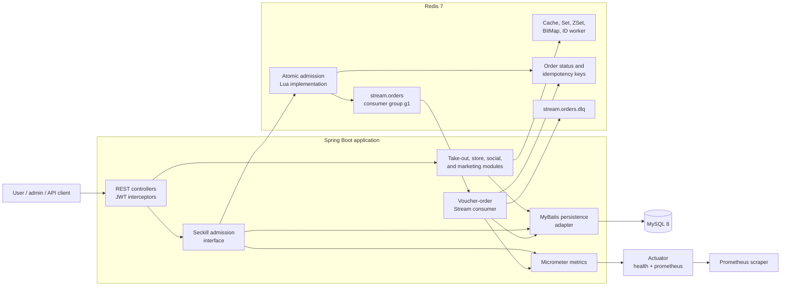
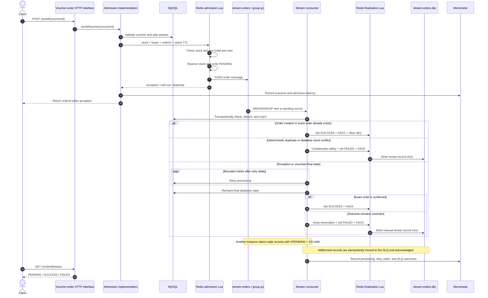

# Local Life Platform

[中文 README](README_CN.md)

## Project Overview

This internship-oriented Spring Boot backend combines take-out ordering, merchant management, store discovery, voucher marketing, social interaction, and a production-minded seckill pipeline in one local life platform.

The project emphasizes evidence-backed engineering rather than feature count: the high-concurrency path is covered by containerized integration tests, a reproducible k6 benchmark, low-cardinality Prometheus metrics, Docker Compose, and Java 8 CI.

## At a Glance

| Area | Implementation and evidence |
| --- | --- |
| Runtime | Java 8, Spring Boot 2.7.3, Maven multi-module build |
| Data | MySQL 8, Redis 7, MyBatis, Redis Lua, Redis Stream |
| Seckill reliability | Atomic admission, asynchronous persistence, bounded retries, `XPENDING` + `XCLAIM` recovery, idempotent finalization, and DLQ review |
| Verification | JUnit 5, Mockito, Testcontainers, k6, Docker Compose, and GitHub Actions |
| Observability | Micrometer timers/counters/gauges exposed through a loopback-restricted Prometheus management endpoint |

### Verified Seckill Benchmark

The committed [load-test report](docs/performance/seckill-load-test.md) records the following local, single-machine Docker results. Seckill req/s measures Redis Lua admission plus Stream publishing; MySQL persistence is asynchronous and reported separately as drain time.

| Concurrent users | Initial stock | Accepted / sold out | Seckill req/s | P95 | Async drain | Cross-store checks |
| ---: | ---: | ---: | ---: | ---: | ---: | :---: |
| 100 | 50 | 50 / 50 | 666.67 | 128.52 ms | 1.78 s | PASS |
| 500 | 250 | 250 / 250 | 998.00 | 267.97 ms | 2.92 s | PASS |
| 1,000 | 500 | 500 / 500 | 1,098.90 | 118.72 ms | 8.20 s | PASS |

These figures are reproducibility evidence for the stated environment, not production-capacity claims. Every scenario verified MySQL orders and stock, Redis stock and buyer qualification, Stream pending/lag, and an empty DLQ.

## Architecture



The public HTTP interface and the `VoucherOrderService` interface form the synchronous seam. Redis Lua hides atomic admission behind that seam, while the Stream consumer and MyBatis persistence adapter keep database work asynchronous and independently recoverable.

## Seckill Core Sequence



## Engineering Highlights

- Redis Lua atomically checks stock and duplicate purchase, reserves qualification, records `PENDING`, and publishes the Stream message.
- The Redis Stream consumer persists orders through a transaction, delays bounded retries, and lets another JVM recover stale messages with `XPENDING + XCLAIM`.
- Success, failure, acknowledgement, retry cleanup, DLQ writes, and deterministic compensation are finalized idempotently by Lua scripts.
- Uncertain database outcomes are not blindly compensated: the reservation is retained and the record is routed to manual review to avoid overselling.
- Testcontainers exercises the public HTTP flow against isolated MySQL 8 and Redis 7 instances, including success, duplicate rejection, manual review, `XCLAIM`, and finalization idempotency.
- k6 scenarios and automated consistency checks make throughput, latency, asynchronous drain time, and Redis/MySQL/Stream invariants reproducible.

## Module Structure

- `sky-common`: shared constants, exceptions, JWT, utils
- `sky-pojo`: entities, DTOs, VOs
- `sky-server`: controllers, services, mappers, configuration, resources

## Core Business Capabilities

### User Side

- phone verification code login with JWT
- browse stores and store types
- view vouchers and seckill vouchers
- place take-out orders
- publish blogs, like blogs, follow users
- daily sign-in and consecutive sign-in count

### Admin Side

- employee login and management
- category, dish, and setmeal management
- order management and reports
- normal voucher creation
- seckill voucher creation

## Platform Technical Highlights

- JWT-based user and admin authentication
- Redis cache for store detail queries
- Redis BitMap for daily sign-in
- Redis Set for follow relationships
- Redis ZSet for blog likes and feed push
- Redis ID worker for distributed-style order ids
- Redis Lua for atomic seckill qualification
- Redis Stream for asynchronous voucher order creation with bounded retries, `XCLAIM` recovery, and DLQ handling
- Reproducible k6 load testing at 100, 500, and 1,000 concurrent users with automated MySQL, Redis, and Redis Stream consistency checks ([report](docs/performance/seckill-load-test.md))
- Micrometer + Prometheus observability for admission outcomes, asynchronous processing, retries, claims, pending messages, and DLQ state
- Lua scripts for atomic order status transitions, acknowledgements, and idempotent compensation
- WebSocket-based order reminder notifications
- mock payment fallback for phone-login users without WeChat `openid`

## New Integration Areas

Compared with a basic take-out system, this version adds:

- store domain: `tb_shop`, `tb_shop_type`
- marketing domain: `tb_voucher`, `tb_seckill_voucher`, `tb_voucher_order`
- social domain: `tb_blog`, `tb_follow`
- phone-code login replacing WeChat-only user login as the main demo path

## Environment

Current local defaults are defined in `sky-server/src/main/resources/application-dev.yml`.

For GitHub, the real `application-dev.yml` is ignored because it may contain local passwords, payment keys, and certificate paths. Copy `sky-server/src/main/resources/application-dev.example.yml` to `sky-server/src/main/resources/application-dev.yml`, then fill in your own local values.

- MySQL: `localhost:3306/sky_take_out`
- Redis: `localhost:6379`, database `10`
- Server port: `8080`
- Management port: `127.0.0.1:8081` (`health` and `prometheus` only; non-Docker runs bind to loopback by default)

## Database Preparation

The repository includes the complete base, marketing, and social schema. Import them in this order:

1. [00-sky_take_out_base.sql](sky-server/src/main/resources/db/00-sky_take_out_base.sql)
2. [sky_take_out_local_life.sql](sky-server/src/main/resources/db/sky_take_out_local_life.sql)
3. [sky_take_out_social.sql](sky-server/src/main/resources/db/sky_take_out_social.sql)

## One-command Docker Startup

```powershell
Copy-Item .env.example .env
docker compose up --build -d
```

The application is available at `http://localhost:8080`, with Knife4j at `http://localhost:8080/doc.html`. Docker publishes the management port on loopback only: health is at `http://localhost:18081/actuator/health` and Prometheus metrics are at `http://localhost:18081/actuator/prometheus`.

To reset the database and rerun all initialization scripts:

```powershell
docker compose down -v
docker compose up --build -d
```

## Run

From the project root:

```bash
mvn -pl sky-server -am spring-boot:run
```

Compile verification:

```bash
mvn -q -pl sky-server -am -DskipTests compile
```

Automated tests:

```bash
mvn -B -ntp test
```

Docker must be available because the seckill integration suite starts isolated MySQL 8 and Redis 7 containers with Testcontainers. It verifies the public HTTP flow for asynchronous success, duplicate-order rejection, retry exhaustion with manual review, and `XCLAIM` recovery from a crashed consumer.

### Reproducible Seckill Load Test

Docker is required. The runner starts isolated application, MySQL, Redis, and k6 containers, performs a separate 50-VU warm-up, then tests 100, 500, and 1,000 concurrent users while verifying MySQL, Redis, and Redis Stream consistency.

```powershell
powershell -ExecutionPolicy Bypass -File .\load-tests\run-seckill-load-test.ps1
```

See the [load-test report](docs/performance/seckill-load-test.md) for throughput, latency, asynchronous drain time, and consistency results.

### Seckill Observability

Actuator runs on a separate management port. Only `health` and `prometheus` are enabled; endpoints such as `info`, `env`, and `configprops` remain disabled. Metric labels use fixed outcome/event enums and never include user ids, voucher ids, order ids, JWTs, or exception messages.

| Prometheus metric | Type | Meaning |
| --- | --- | --- |
| `sky_seckill_admission_requests_total` | Counter | accepted, sold-out, duplicate, invalid, and error admission outcomes |
| `sky_seckill_admission_duration_seconds` | Histogram | synchronous Redis Lua admission latency by outcome |
| `sky_seckill_processing_records_total` | Counter | processing attempts resulting in created, idempotent, retry, failed, manual-review, or malformed outcomes |
| `sky_seckill_processing_duration_seconds` | Histogram | asynchronous record-processing latency by outcome |
| `sky_seckill_stream_events_total` | Counter | `XCLAIM`, retry exhaustion, DLQ writes, consumer errors, and gauge refresh errors |
| `sky_seckill_stream_pending` | Gauge | current pending-list size for consumer group `g1` |
| `sky_seckill_stream_dlq_size` | Gauge | current dead-letter Stream length |

Example PromQL:

```promql
sum(rate(sky_seckill_admission_requests_total[1m])) by (outcome)
histogram_quantile(0.95, sum(rate(sky_seckill_admission_duration_seconds_bucket[5m])) by (le, outcome))
increase(sky_seckill_processing_records_total{outcome="retry"}[5m])
increase(sky_seckill_stream_events_total{event=~"retry_exhausted|dlq_.*|consumer_error|state_refresh_error"}[5m])
sky_seckill_stream_pending
sky_seckill_stream_dlq_size
```

`sky_seckill_processing_records_total` counts processing attempts rather than unique messages, so one message can first contribute a `retry` outcome and later contribute its terminal outcome. If a pending/DLQ gauge refresh fails, the gauge retains its last successfully observed value and the failure increments `sky_seckill_stream_events_total{event="state_refresh_error"}`.

Non-Docker runs bind the management server to `127.0.0.1` by default. Docker explicitly listens inside the container and restricts the host mapping to `127.0.0.1`. In a deployed environment, keep the management port behind a private network, gateway, or firewall rather than exposing it directly to the internet.

Quick smoke test:

```powershell
$env:SKY_AUTH_FIXED_LOGIN_CODE="123456" # set this before starting the server
powershell -ExecutionPolicy Bypass -File .\smoke-test.ps1 -Code 123456
```

The script will:

- send a login code
- use the explicitly configured local development code
- test public store, voucher, and blog APIs
- test authenticated user, social, sign-in, and seckill APIs

After startup:

- Swagger/Knife4j: `http://localhost:8080/doc.html`

## Recommended Demo Path

### 1. Login

1. `POST /user/user/code?phone=13800138000`
2. For local development only, set `SKY_AUTH_FIXED_LOGIN_CODE` before starting the server
3. `POST /user/user/login`

Example body:

```json
{
  "phone": "13800138000",
  "code": "123456"
}
```

Use the returned JWT in header:

```text
authentication: <token>
```

### 2. Local Life Flow

1. query store types: `GET /user/store-type/list`
2. query stores by type: `GET /user/store/of/type?typeId=1&current=1`
3. query vouchers of a store: `GET /user/voucher/list/1`
4. create a seckill order: `POST /user/voucher-order/seckill/2`
5. query the asynchronous result: `GET /user/voucher-order/{orderId}/status`

### 3. Social Flow

1. publish blog: `POST /user/blog`
2. query hot blogs: `GET /user/blog/hot?current=1`
3. like blog: `PUT /user/blog/like/{id}`
4. follow user: `PUT /user/follow/{id}/true`
5. query feed: `GET /user/blog/of/follow?lastId=<timestamp>&offset=0`
6. daily sign: `POST /user/user/sign`
7. sign count: `GET /user/user/sign/count`

### 4. Take-out Flow

1. manage address
2. add items to shopping cart
3. submit order: `POST /user/order/submit`
4. pay order: `PUT /user/order/payment`

If the current user has no WeChat `openid`, mock payment is disabled by default. Enable it only for local development with:

- `SKY_PAY_MOCK_ENABLED=true`

## High-Concurrency Seckill Design

The seckill order flow is implemented in:

- [VoucherOrderServiceImpl.java](sky-server/src/main/java/com/sky/service/impl/VoucherOrderServiceImpl.java)
- [seckill.lua](sky-server/src/main/resources/seckill.lua)
- [seckill_complete.lua](sky-server/src/main/resources/seckill_complete.lua)
- [seckill_fail.lua](sky-server/src/main/resources/seckill_fail.lua)

Flow:

1. request reaches `/user/voucher-order/seckill/{id}`
2. Lua checks stock and duplicate purchase, decrements stock, writes the Stream message, and records `PENDING` atomically
3. the background consumer creates the database order asynchronously
4. successful processing atomically records `SUCCESS`, acknowledges the Stream message, and clears retry state
5. failed processing uses bounded delayed retries instead of a hot pending-list loop
6. another instance can recover stale messages from crashed consumers through `XPENDING + XCLAIM`
7. after retries are exhausted, the service checks the final database state before applying any compensation
8. only deterministic conflicts are compensated automatically; uncertain outcomes keep their reservation and are sent to the DLQ for review
9. failed or review-required messages are marked `FAILED` and acknowledged atomically, while a late confirmed database commit can still correct an uncompensated status to `SUCCESS`

The client can poll `GET /user/voucher-order/{orderId}/status`. The endpoint only exposes the current user's order and falls back to the database when Redis status data is unavailable.

Available states:

- `PENDING`: qualification passed and the database order is being created
- `SUCCESS`: the database order exists
- `FAILED`: processing was terminated; the response may include a failure reason

Reliability settings:

| Environment variable | Default | Purpose |
| --- | ---: | --- |
| `SKY_SECKILL_CONSUMER_NAME` | host name | consumer name prefix; each JVM appends a UUID |
| `SKY_SECKILL_MAX_RETRIES` | `3` | maximum processing attempts |
| `SKY_SECKILL_RETRY_DELAY_MS` | `2000` | delay before retrying current-consumer pending messages |
| `SKY_SECKILL_CLAIM_IDLE_MS` | `30000` | idle time before another consumer may claim a message |
| `SKY_SECKILL_BLOCK_TIMEOUT_MS` | `2000` | blocking Stream read timeout |
| `SKY_SECKILL_METRICS_REFRESH_MS` | `5000` | interval for refreshing pending and DLQ gauges |

## Important Entry Files

- app start: [SkyApplication.java](sky-server/src/main/java/com/sky/SkyApplication.java)
- user login: [UserController.java](sky-server/src/main/java/com/sky/controller/user/UserController.java)
- store APIs: [StoreController.java](sky-server/src/main/java/com/sky/controller/user/StoreController.java)
- voucher APIs: [VoucherController.java](sky-server/src/main/java/com/sky/controller/user/VoucherController.java)
- seckill ordering: [VoucherOrderServiceImpl.java](sky-server/src/main/java/com/sky/service/impl/VoucherOrderServiceImpl.java)
- seckill metrics: [SeckillMetrics.java](sky-server/src/main/java/com/sky/metrics/SeckillMetrics.java)
- social APIs: [BlogController.java](sky-server/src/main/java/com/sky/controller/user/BlogController.java)
- follow APIs: [FollowController.java](sky-server/src/main/java/com/sky/controller/user/FollowController.java)
- order flow: [OrderServiceImpl.java](sky-server/src/main/java/com/sky/service/impl/OrderServiceImpl.java)

## Project Presentation

- [Chinese resume bullets, three-minute walkthrough, design trade-offs, failure scenarios, and interview questions](docs/project-presentation-cn.md)
- [Reproducible seckill load-test report](docs/performance/seckill-load-test.md)
- [HTTP endpoint overview](API_OVERVIEW.md)

## Project Summary

You can describe this project like this:

> Built a Spring Boot local life platform by integrating take-out ordering, store discovery, voucher marketing, social blog interaction, and high-concurrency seckill ordering. Implemented JWT login, Redis caching, BitMap sign-in, ZSet-based feed/likes, and Lua + Redis Stream asynchronous order processing.
