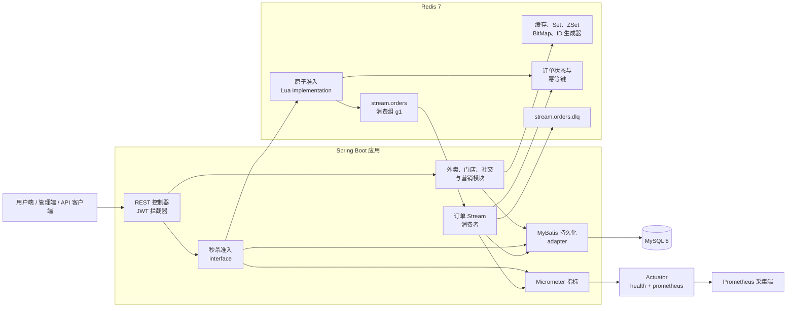
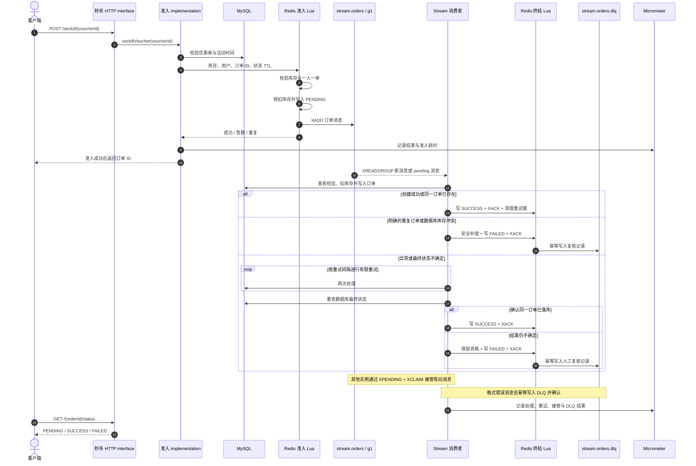

# 本地生活平台

[English README](README.md)

## 项目简介

这是一个面向实习求职展示的 Spring Boot 本地生活平台后端，将外卖下单、商家管理、门店发现、优惠券营销、点评社交与工程化秒杀链路整合在同一个项目中。

项目不以堆叠功能数量为目标，而是强调可验证的工程能力：高并发链路配有容器化集成测试、可复现 k6 压测、低基数 Prometheus 指标、Docker Compose 环境与 Java 8 持续集成。

## 项目速览

| 维度 | 实现与证据 |
| --- | --- |
| 运行时 | Java 8、Spring Boot 2.7.3、Maven 多模块构建 |
| 数据层 | MySQL 8、Redis 7、MyBatis、Redis Lua、Redis Stream |
| 秒杀可靠性 | 原子准入、异步落库、有限重试、`XPENDING + XCLAIM` 接管、幂等终结和 DLQ 人工复核 |
| 质量保障 | JUnit 5、Mockito、Testcontainers、k6、Docker Compose、GitHub Actions |
| 可观测性 | Micrometer Counter/Timer/Gauge，通过仅限回环地址访问的管理端口暴露 Prometheus 指标 |

### 已验证的秒杀压测

仓库内的[秒杀压测报告](docs/performance/seckill-load-test.md)记录了以下本机单节点 Docker 实测结果。秒杀 req/s 只计算 Redis Lua 准入和 Stream 投递；MySQL 异步落库耗时单独通过 drain time 展示。

| 并发用户 | 初始库存 | 成功 / 售罄 | 秒杀 req/s | P95 | 异步清空耗时 | 跨存储校验 |
| ---: | ---: | ---: | ---: | ---: | ---: | :---: |
| 100 | 50 | 50 / 50 | 666.67 | 128.52 ms | 1.78 s | PASS |
| 500 | 250 | 250 / 250 | 998.00 | 267.97 ms | 2.92 s | PASS |
| 1000 | 500 | 500 / 500 | 1098.90 | 118.72 ms | 8.20 s | PASS |

这些数字用于证明指定环境下的可复现性，不代表生产容量。每个场景都校验了 MySQL 订单与库存、Redis 库存与购买资格、Stream pending/lag 以及空 DLQ。

## 总体架构



公开 HTTP interface 与 `VoucherOrderService` interface 构成同步 seam。Redis Lua 将原子准入的 implementation 隐藏在该 seam 之后；Stream 消费者和 MyBatis 持久化 adapter 则让数据库写入保持异步，并可独立重试和恢复。

## 秒杀核心时序



## 核心工程亮点

- Redis Lua 原子完成库存校验、一人一单、资格预扣、`PENDING` 状态记录与 Stream 投递。
- Redis Stream 消费者在事务中落库，通过延迟有限重试避免 pending 热循环，并允许其他 JVM 使用 `XPENDING + XCLAIM` 接管陈旧消息。
- 成功、失败、消息确认、重试键清理、DLQ 写入和确定性补偿由 Lua 幂等终结，避免重复消费造成二次副作用。
- 数据库最终状态不确定时不盲目回补库存，而是保留资格并进入人工复核，避免错误补偿导致超卖。
- Testcontainers 通过公开 HTTP 流程验证 MySQL 8 与 Redis 7 上的成功下单、重复拒绝、人工复核、`XCLAIM` 和终结幂等。
- k6 场景及自动一致性校验让吞吐、延迟、异步清空耗时以及 Redis/MySQL/Stream 不变量可复现。

## 模块结构

- `sky-common`：公共常量、异常、JWT、工具类
- `sky-pojo`：实体类、DTO、VO
- `sky-server`：控制器、业务逻辑、Mapper、配置、资源文件

## 核心功能

### 用户端

- 手机验证码登录 + JWT
- 门店和门店分类浏览
- 优惠券和秒杀券查看
- 外卖下单和支付
- 博客发布、点赞、关注
- 每日签到和连续签到统计

### 管理端

- 员工登录和管理
- 分类、菜品、套餐管理
- 订单管理和报表统计
- 普通优惠券创建
- 秒杀优惠券创建

## 平台技术亮点

- JWT 鉴权
- Redis 门店缓存
- Redis BitMap 签到
- Redis Set 关注关系
- Redis ZSet 点赞和动态流
- Redis Lua 原子抢券
- Redis Stream 异步秒杀下单，支持有限重试、`XCLAIM` 故障接管和 DLQ
- 使用 k6 复现 100、500、1000 并发秒杀，并自动校验 MySQL、Redis 与 Redis Stream 一致性（[压测报告](docs/performance/seckill-load-test.md)）
- 使用 Micrometer + Prometheus 监控准入结果、异步落库、重试、消息接管、pending 和 DLQ
- Lua 原子维护订单状态、消息确认与失败补偿，避免重复消费和错误回补
- WebSocket 订单提醒
- Mock 支付兜底

## 业务扩展

相比基础外卖系统，这个版本增加了：

- 门店模块：`tb_shop`、`tb_shop_type`
- 营销模块：`tb_voucher`、`tb_seckill_voucher`、`tb_voucher_order`
- 社交模块：`tb_blog`、`tb_follow`

## 环境要求

- MySQL：`localhost:3306/sky_take_out`
- Redis：`localhost:6379`，数据库 `10`
- 服务端口：`8080`
- 管理端口：`127.0.0.1:8081`（仅启用 `health` 和 `prometheus`；非 Docker 启动默认只监听本机回环地址）

## 配置说明

本地真实配置文件是 `sky-server/src/main/resources/application-dev.yml`，仓库里保留的是模板文件 `application-dev.example.yml`。

你可以复制模板后填写自己的本地配置：

```text
sky-server/src/main/resources/application-dev.example.yml
-> sky-server/src/main/resources/application-dev.yml
```

JWT 密钥不再提供不安全的默认值，请在本地配置文件或环境变量中显式设置。仅本地联调时，可设置固定验证码：

```powershell
$env:SKY_JWT_ADMIN_SECRET="至少32位随机字符串"
$env:SKY_JWT_USER_SECRET="另一段至少32位随机字符串"
$env:SKY_AUTH_FIXED_LOGIN_CODE="123456"
```

验证码和 JWT 不会写入应用日志。

## 数据库初始化

仓库已经包含完整的基础表、营销表和社交表脚本，建议顺序：

1. 导入 `00-sky_take_out_base.sql`
2. 导入 `sky_take_out_local_life.sql`
3. 导入 `sky_take_out_social.sql`

对应文件：

- [00-sky_take_out_base.sql](sky-server/src/main/resources/db/00-sky_take_out_base.sql)
- [sky_take_out_local_life.sql](sky-server/src/main/resources/db/sky_take_out_local_life.sql)
- [sky_take_out_social.sql](sky-server/src/main/resources/db/sky_take_out_social.sql)

## Docker 一键启动

```powershell
Copy-Item .env.example .env
docker compose up --build -d
```

启动后：

- 服务：`http://localhost:8080`
- Knife4j：`http://localhost:8080/doc.html`
- 健康检查：`http://localhost:18081/actuator/health`
- Prometheus 指标：`http://localhost:18081/actuator/prometheus`
- MySQL：`localhost:13306/sky_take_out`
- Redis：`localhost:16379`

查看状态和日志：

```powershell
docker compose ps
docker compose logs -f app
```

如需重新执行初始化 SQL：

```powershell
docker compose down -v
docker compose up --build -d
```

## 启动方式

```powershell
mvn -pl sky-server -am spring-boot:run
```

编译检查：

```powershell
mvn -q -pl sky-server -am -DskipTests compile
```

自动化测试：

```powershell
mvn -B -ntp test
```

秒杀集成测试使用 Testcontainers 自动启动隔离的 MySQL 8 和 Redis 7，因此运行测试时需要本机或 CI 提供 Docker。测试通过公开 HTTP 接口覆盖异步下单成功、一人一单、重试耗尽进入人工处理，以及崩溃消费者消息被 `XCLAIM` 接管。

### 可复现秒杀压测

需要本机提供 Docker。脚本会启动隔离的应用、MySQL、Redis 和 k6 容器，先执行独立的 50 VU 预热，再依次测试 100、500、1000 并发用户，并自动校验 MySQL、Redis 与 Redis Stream 的数据一致性。

```powershell
powershell -ExecutionPolicy Bypass -File .\load-tests\run-seckill-load-test.ps1
```

吞吐量、延迟、异步落库耗时和一致性结果见[秒杀压测报告](docs/performance/seckill-load-test.md)。

### 秒杀可观测性

Actuator 使用独立管理端口，只启用 `health` 和 `prometheus`；`info`、`env`、`configprops` 等端点保持关闭。指标标签全部来自固定枚举，不会写入用户 ID、优惠券 ID、订单 ID、JWT 或异常文本。

| Prometheus 指标 | 类型 | 含义 |
| --- | --- | --- |
| `sky_seckill_admission_requests_total` | Counter | 秒杀成功、售罄、重复、非法请求和异常准入结果 |
| `sky_seckill_admission_duration_seconds` | Histogram | 按结果区分的 Redis Lua 同步准入耗时 |
| `sky_seckill_processing_records_total` | Counter | 处理尝试，按创建、幂等成功、重试、失败、人工复核和格式错误结果统计 |
| `sky_seckill_processing_duration_seconds` | Histogram | 按结果区分的异步消息处理耗时 |
| `sky_seckill_stream_events_total` | Counter | `XCLAIM`、重试耗尽、DLQ、消费者异常和 Gauge 刷新异常 |
| `sky_seckill_stream_pending` | Gauge | 消费组 `g1` 当前 pending 消息数 |
| `sky_seckill_stream_dlq_size` | Gauge | 当前死信 Stream 长度 |

常用 PromQL：

```promql
sum(rate(sky_seckill_admission_requests_total[1m])) by (outcome)
histogram_quantile(0.95, sum(rate(sky_seckill_admission_duration_seconds_bucket[5m])) by (le, outcome))
increase(sky_seckill_processing_records_total{outcome="retry"}[5m])
increase(sky_seckill_stream_events_total{event=~"retry_exhausted|dlq_.*|consumer_error|state_refresh_error"}[5m])
sky_seckill_stream_pending
sky_seckill_stream_dlq_size
```

`sky_seckill_processing_records_total` 统计的是处理尝试，而不是去重后的消息数，因此同一条消息可能先产生一次 `retry`，之后再产生一次最终结果。pending/DLQ Gauge 刷新失败时会保留上一次成功获取的值，同时增加 `sky_seckill_stream_events_total{event="state_refresh_error"}`。

非 Docker 启动时，管理服务默认只监听 `127.0.0.1`。Docker 容器内显式监听所有接口，但宿主机管理端口仍只映射到 `127.0.0.1`。部署时应继续通过内网、网关或防火墙限制访问，不要直接暴露到公网。

冒烟测试：

```powershell
powershell -ExecutionPolicy Bypass -File .\smoke-test.ps1 -Code 123456
```

## 秒杀可靠性设计

秒杀请求不会同步写入数据库，而是先通过 Redis Lua 完成库存校验、一人一单校验、库存预扣、订单状态记录和 Stream 消息写入，再由后台消费者异步创建订单。

处理流程：

1. `POST /user/voucher-order/seckill/{id}` 返回订单 ID，并将订单状态原子记录为 `PENDING`
2. 消费者从 `stream.orders` 读取消息并创建数据库订单
3. 处理成功后原子更新为 `SUCCESS`、确认 Stream 消息并清理重试状态
4. 处理失败时按固定间隔进行有限次数重试，避免消息持续热循环
5. 消费者异常退出后，其他实例通过 `XPENDING + XCLAIM` 接管超过空闲时间的消息
6. 重试耗尽后，先查询数据库最终状态；只有明确的重复订单或库存不一致才自动补偿
7. 无法安全判断最终状态时不恢复库存、不释放资格，而是写入 DLQ 等待人工处理，避免错误回补造成超卖
8. 未执行补偿的不确定状态允许被迟到的数据库成功结果修正为 `SUCCESS`

客户端可通过以下接口查询异步处理结果：

```http
GET /user/voucher-order/{orderId}/status
```

状态说明：

- `PENDING`：已通过秒杀资格校验，正在异步创建订单
- `SUCCESS`：数据库订单创建成功
- `FAILED`：处理失败，可通过返回的 `message` 查看原因

状态接口会校验当前登录用户，不能查询其他用户的秒杀订单；Redis 状态丢失时会回源数据库确认结果。

相关配置可通过环境变量调整：

| 环境变量 | 默认值 | 说明 |
| --- | ---: | --- |
| `SKY_SECKILL_CONSUMER_NAME` | 当前主机名 | 消费者名称前缀，每个 JVM 会自动追加 UUID |
| `SKY_SECKILL_MAX_RETRIES` | `3` | 单条消息最大处理次数 |
| `SKY_SECKILL_RETRY_DELAY_MS` | `2000` | 当前消费者重试间隔，单位毫秒 |
| `SKY_SECKILL_CLAIM_IDLE_MS` | `30000` | 消息空闲多久后允许被其他消费者接管 |
| `SKY_SECKILL_BLOCK_TIMEOUT_MS` | `2000` | Stream 阻塞读取超时时间，单位毫秒 |
| `SKY_SECKILL_METRICS_REFRESH_MS` | `5000` | pending 和 DLQ Gauge 的刷新间隔，单位毫秒 |

## 接口文档

- Knife4j：`http://localhost:8080/doc.html`

## 相关资料

- [接口总览](API_OVERVIEW.md)
- [项目展示、简历描述与面试说明](docs/project-presentation-cn.md)
- [可复现秒杀压测报告](docs/performance/seckill-load-test.md)
